# SaaS Provider Resource Identification Analysis

**Date:** 2026-03-27
**Purpose:** Research and analysis of resource identification schemes for Salesforce, SAP, and ServiceNow — to inform CRIT dictionary design for SaaS providers.

---

## Table of Contents

1. [Executive Summary](#1-executive-summary)
2. [Reference: AWS ARN Anatomy](#2-reference-aws-arn-anatomy)
3. [Salesforce](#3-salesforce)
4. [SAP](#4-sap)
5. [ServiceNow](#5-servicenow)
6. [Cross-Provider Comparison Matrix](#6-cross-provider-comparison-matrix)
7. [Proposed Universal CRIT Segment Mapping](#7-proposed-universal-crit-segment-mapping)
8. [CRIT Template Recommendations](#8-crit-template-recommendations)

---

## 1. Executive Summary

Cloud-infrastructure providers (AWS, Azure, GCP) publish a single, well-defined canonical resource identifier format (ARN, Azure Resource ID, GCP resource name). SaaS providers do not. Each platform uses a different philosophy:

- **Salesforce** identifies resources with a compact, positionally-encoded 18-character base-62 string where every segment — object type, deployment pod, and unique record — is embedded in the ID itself. There is no ARN equivalent, but a record ID combined with the instance/org uniquely identifies any resource globally.
- **SAP** has no unified canonical ID. Resource identification is fragmented across at least two major platforms (BTP and S/4HANA), each using a different scheme — UUID v4 for cloud/BTP resources and a compound tuple of SID + client + object ID for on-premise/ABAP resources.
- **ServiceNow** uses a 32-character hexadecimal UUID (`sys_id`) as the universal primary key for every record in every table. The instance hostname scopes the `sys_id` globally. Object type is expressed as the table name in the REST API path, not encoded in the ID.

None of the three platforms publish an "ARN-equivalent" canonical string that encodes all segments in a single opaque token suitable for use as a portable identifier across systems. CRIT templates for these providers will be URL-pattern templates rather than opaque identifier patterns.

---

## 2. Reference: AWS ARN Anatomy

AWS ARNs are the benchmark for comparison. All segments are positionally encoded into a single colon-delimited string.

```
arn:aws:s3:::my-bucket
arn:aws:iam::123456789012:user/johndoe
arn:aws:ec2:us-east-1:123456789012:instance/i-0abc123def456789
```

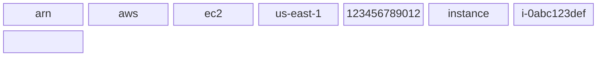

| Position | Segment | Description | Example |
|---|---|---|---|
| 1 | `arn` | Fixed literal | `arn` |
| 2 | `partition` | AWS partition | `aws`, `aws-cn`, `aws-us-gov` |
| 3 | `service` | AWS service namespace | `ec2`, `s3`, `iam` |
| 4 | `region` | AWS region (empty for global) | `us-east-1` |
| 5 | `account` | 12-digit AWS account ID | `123456789012` |
| 6+ | `resource` | Resource type and/or ID | `instance/i-0abc123def` |

**Key properties:** Single string, globally unique, human-readable, embeds all context, no lookup required to understand structure.

---

## 3. Salesforce

### 3.1 Resource Model

Salesforce organizes resources in a four-level hierarchy. Authentication context (Connected Apps, Named Credentials) operates as a cross-cutting layer.

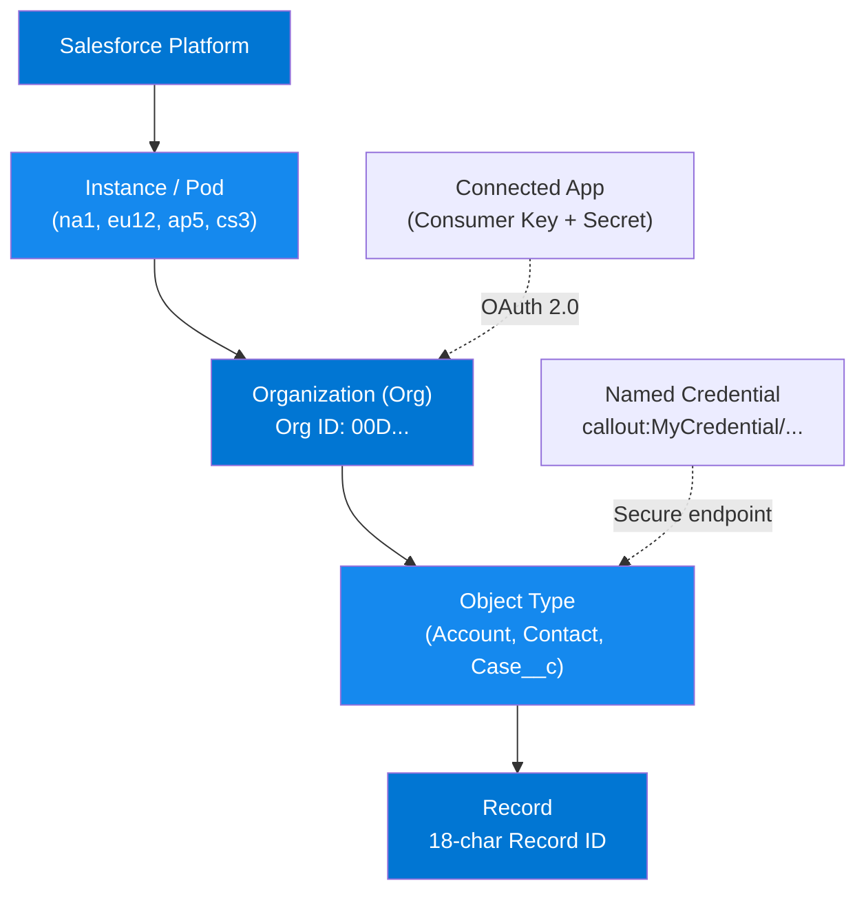

### 3.2 Identifier Anatomy

#### 3.2.1 Record ID (18-character format)

The 18-character format is the canonical, case-insensitive form recommended for all external systems, APIs, and integrations. Characters are base-62 encoded (digits 0–9, lowercase a–z, uppercase A–Z).

```
Example:  0 0 1 2 x 0 0 0 0 0 R Y h G 3 A A L
Position: 1 2 3 4 5 6 7 8 9 ...        16 17 18
Segments: [---1---][---2---][3][-----4------][--5--]
```

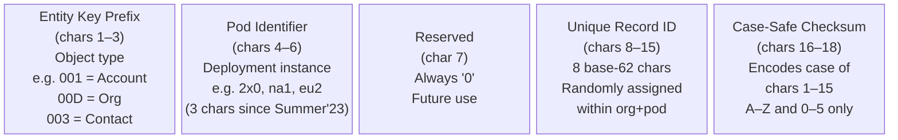

**15-character format** (original, case-sensitive, used in Salesforce UI and classic reports):
Drop the last 3 checksum characters. This format is case-sensitive and not safe for external systems.

#### 3.2.2 Organization ID

The Org ID is itself a record ID for the Organization object, with entity key prefix `00D`:

```
00D6A000002fFTLUA2
^^^                  → 00D  (Organization object type)
   ^^^               → 6A0  (Pod identifier)
      ^              → 0    (Reserved)
       ^^^^^^^^      → 002fFTL  (Unique org record)
               ^^^   → UA2  (Checksum)
```

#### 3.2.3 Common Entity Key Prefixes

| Prefix | Object Type |
|---|---|
| `00D` | Organization (Org) |
| `001` | Account |
| `003` | Contact |
| `005` | User |
| `006` | Opportunity |
| `500` | Case |
| `00Q` | Lead |
| `00T` | Task |
| `00U` | Event |
| `a00` — `zzz` | Custom objects (generated, varies per org) |

Custom object prefixes are org-specific and assigned at object creation time. The full current list can be retrieved via the REST API: `GET /services/data/v{api-version}/sobjects/`.

### 3.3 Variable Segments

| Segment | Description | Format / Regex | Example |
|---|---|---|---|
| `instance` | Pod / data-center cluster | `(na\|eu\|ap\|cs\|gs0)\d+` | `na1`, `eu12`, `ap5`, `cs3` |
| `my-domain` | Custom My Domain subdomain | `[a-z0-9][a-z0-9-]*` | `acmecorp`, `my-company` |
| `org-id` | Organization record ID | 18-char base-62, prefix `00D` | `00D6A000002fFTLUA2` |
| `api-version` | REST API version | `v\d+\.\d` | `v66.0` (Spring '26) |
| `object-type` | sObject API name | `[A-Z][A-Za-z0-9]*(__c)?` | `Account`, `MyObj__c` |
| `namespace` | Managed package namespace | `[a-z][a-z0-9]{1,14}` | `mypackage` |
| `record-id` | 18-character record identifier | base-62, 18 chars | `001Rt000000RYhGIAW` |
| `entity-prefix` | 3-char object type code | `[0-9A-Za-z]{3}` | `001`, `00D`, `500` |

### 3.4 API URL Patterns

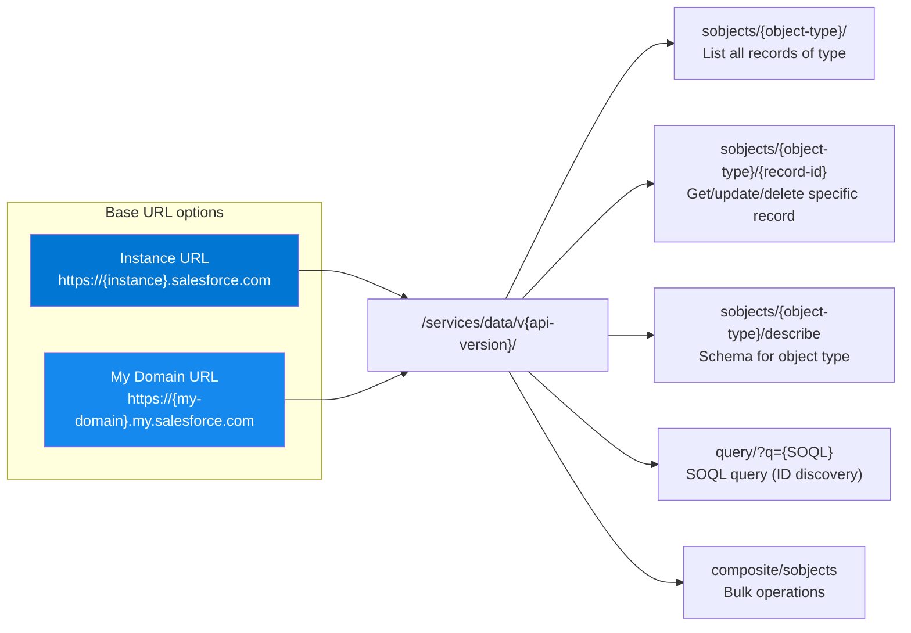

**Complete URL examples:**

| Operation | URL Pattern |
|---|---|
| List object types | `https://{instance}.salesforce.com/services/data/v{ver}/sobjects/` |
| Get record | `https://{instance}.salesforce.com/services/data/v{ver}/sobjects/{ObjectType}/{record-id}` |
| SOQL query | `https://{instance}.salesforce.com/services/data/v{ver}/query/?q=SELECT+Id+FROM+{ObjectType}+WHERE+...` |
| Object schema | `https://{instance}.salesforce.com/services/data/v{ver}/sobjects/{ObjectType}/describe` |
| My Domain base | `https://{my-domain}.my.salesforce.com/services/data/v{ver}/sobjects/{ObjectType}/{record-id}` |

### 3.5 Discovering a Record ID When Unknown

When a record ID is not known, it must be discovered via SOQL query.

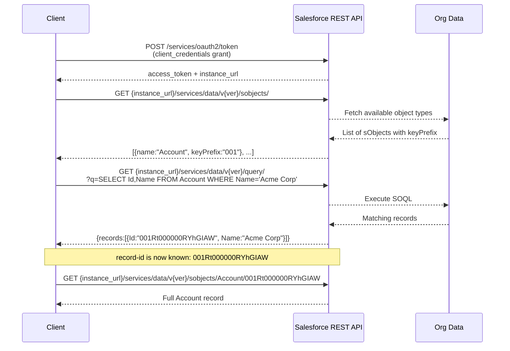

### 3.6 Proposed CRIT Template Format

**Template format name:** `salesforce_url`

```
https://{instance}.salesforce.com/services/data/v{api-version}/sobjects/{object-type}/{record-id}
```

Or with My Domain:

```
https://{my-domain}.my.salesforce.com/services/data/v{api-version}/sobjects/{object-type}/{record-id}
```

**CRIT slot mapping:**

| CRIT Slot | Slot State | Notes |
|---|---|---|
| `{instance}` | Named variable | Pod identifier (na1, eu12); omit when using My Domain |
| `{my-domain}` | Named variable | Custom subdomain; alternative to `{instance}` |
| `{api-version}` | Hardcoded or named variable | e.g., `v66.0`; typically hardcoded per entry |
| `{object-type}` | Hardcoded per dictionary entry | e.g., `Account`, `Contact` |
| `{record-id}` | Named variable or wildcard | 18-char base-62 record ID |

**Example CRIT dictionary entries:**

```json
{ "service": "crm", "resource_type": "account", "template": "https://{instance}.salesforce.com/services/data/v{api-version}/sobjects/Account/{record-id}", "template_format": "salesforce_url", "region_behavior": "regional" },
{ "service": "crm", "resource_type": "contact", "template": "https://{instance}.salesforce.com/services/data/v{api-version}/sobjects/Contact/{record-id}", "template_format": "salesforce_url", "region_behavior": "regional" },
{ "service": "crm", "resource_type": "org", "template": "https://{instance}.salesforce.com/services/data/v{api-version}/sobjects/Organization/{org-id}", "template_format": "salesforce_url", "region_behavior": "regional" }
```

---

## 4. SAP

SAP has no single ARN-equivalent canonical identifier. Resource identification is fragmented across at least two distinct platforms with incompatible schemes.

### 4.1 Platform Overview

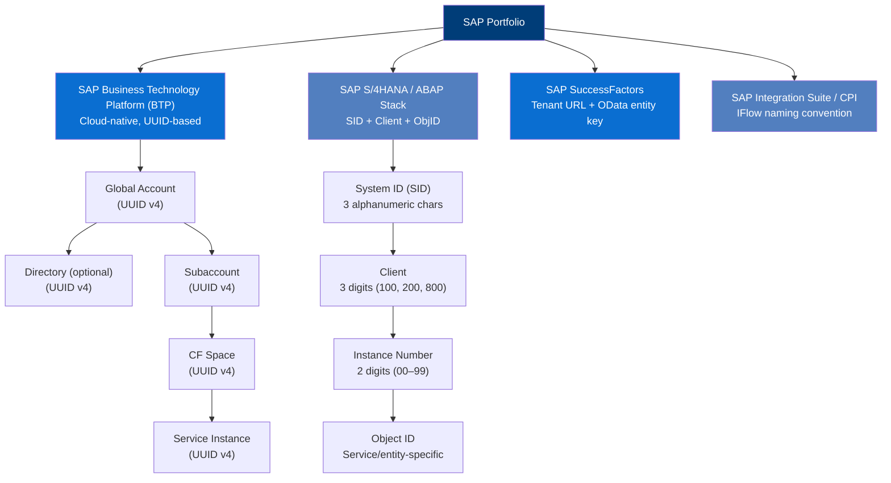

### 4.2 SAP BTP (Business Technology Platform)

All BTP resource identifiers are UUID v4 (RFC 4122):
`xxxxxxxx-xxxx-4xxx-yxxx-xxxxxxxxxxxx` (32 hex digits + 4 hyphens = 36 characters)

#### 4.2.1 Account Hierarchy and GUIDs

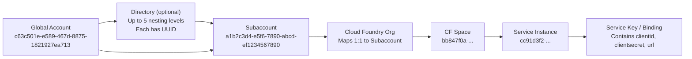

#### 4.2.2 BTP Variable Segments

| Segment | Description | Format | Example |
|---|---|---|---|
| `region` | BTP landscape / data-center | `[a-z]{2}\d+` | `eu10`, `us10`, `ap21`, `jp10` |
| `global-account-guid` | Top-level account | UUID v4 | `c63c501e-e589-467d-8875-1821927ea713` |
| `subaccount-guid` | Workload isolation boundary | UUID v4 | `a1b2c3d4-e5f6-7890-abcd-ef1234567890` |
| `subdomain` | Human-readable subaccount name | `[a-z0-9][a-z0-9-]*` | `my-team-dev`, `prod-eu` |
| `space-guid` | Cloud Foundry space | UUID v4 | Obtained via `cf space <name> --guid` |
| `service-instance-guid` | BTP service instance | UUID v4 | Obtained via `cf service <name> --guid` |
| `org-guid` | Cloud Foundry org (= subaccount) | UUID v4 | Obtained via `cf org <name> --guid` |

#### 4.2.3 BTP API URL Patterns

| Resource | URL Pattern |
|---|---|
| BTP Cockpit | `https://account.{region}.hana.ondemand.com/cockpit/#/globalaccount/{global-account-guid}/subaccount/{subaccount-guid}` |
| CF API (service instances) | `https://api.cf.{region}.hana.ondemand.com/v2/service_instances/{service-instance-guid}` |
| CF API (spaces) | `https://api.cf.{region}.hana.ondemand.com/v2/spaces/{space-guid}` |
| BTP CLI (global account) | `btp list accounts/subaccount --global-account {global-account-guid}` |
| Service key credentials | Retrieved from: `cf service-key {instance-name} {key-name}` |

### 4.3 SAP S/4HANA and ABAP Stack

#### 4.3.1 System Identification

The fundamental identifier for any ABAP-based SAP system is the **System ID (SID)** — a 3-character alphanumeric code set at installation time and immutable thereafter.

```
System ID (SID): PRD
                 ^^^
                 3 uppercase alphanumeric characters
                 Identifies the SAP system uniquely within a landscape
                 Examples: PRD (production), DEV (development), QAS (quality assurance)
```

A fully qualified ABAP resource reference requires the compound tuple:

```
{SID} / {Client} / {InstanceNo} / {ObjectType} / {ObjectID}

Example: PRD/100/00/PerPerson/00100000
         ^^^  ^^^  ^^  ^^^^^^^^^  ^^^^^^^^
          |    |    |      |          +-- Entity key (varies by object type)
          |    |    |      +------------- OData entity set name
          |    |    +-------------------- 2-digit instance number
          |    +------------------------- 3-digit client number
          +-------------------------------- 3-char System ID
```

#### 4.3.2 ABAP / S/4HANA Variable Segments

| Segment | Description | Format | Example |
|---|---|---|---|
| `sid` | System ID | `[A-Z0-9]{3}` | `PRD`, `DEV`, `QAS`, `VP7` |
| `client` | ABAP client number | `\d{3}` | `100`, `200`, `800` |
| `instance-no` | Application server instance | `\d{2}` | `00`, `01`, `10` |
| `host` | Application server hostname | FQDN | `s4hana.corp.example.com` |
| `tenant-id` | Cloud tenant ID (S/4HANA Cloud) | `\d{6,10}` | `123456`, `0123456789` |
| `landscape` | Environment tier | `dev\|qas\|prd` | `prd` |
| `service-name` | OData service name | `[A-Z_]+` | `API_BUSINESS_PARTNER`, `ZEMPLOYEE_SRV` |
| `entity-set` | OData entity set | `[A-Za-z]+` | `A_BusinessPartner`, `EmployeeSet` |
| `object-id` | Entity key (type-specific) | Varies | `00100000`, `'JOHN'` |

#### 4.3.3 OData API URL Patterns

```
http://{host}:{port}/sap/opu/odata/sap/{service-name}/{entity-set}({key})
```

Port convention: HTTP = `8000 + {instance-no}` | HTTPS = `4300 + {instance-no}`

| Operation | URL Pattern |
|---|---|
| Service metadata | `https://{host}:{port}/sap/opu/odata/sap/{service-name}/$metadata` |
| Entity collection | `https://{host}:{port}/sap/opu/odata/sap/{service-name}/{entity-set}` |
| Single entity | `https://{host}:{port}/sap/opu/odata/sap/{service-name}/{entity-set}({key})` |
| Filtered query | `https://{host}:{port}/sap/opu/odata/sap/{service-name}/{entity-set}?$filter=...` |

**S/4HANA Cloud (API Hub) base URL:**
`https://{tenant-id}.{landscape}.api.sap.com/{service-path}`

### 4.4 SAP SuccessFactors

SuccessFactors uses OData v2/v4 with a data-center-specific API server hostname:

```
https://{api-server}.successfactors.com/odata/v2/{entity-set}({key})
```

| Segment | Description | Example |
|---|---|---|
| `api-server` | Data-center-specific API hostname | `api4`, `api8`, `apisalesdemo`, `api012` |
| `entity-set` | SuccessFactors entity | `PerPersonal`, `EmpEmployment`, `User` |
| `key` | Entity primary key | `userId='jdoe'`, `personIdExternal='12345'` |

The `api-server` value is assigned at tenant provisioning and must be retrieved from the SuccessFactors admin console (Admin Center → Company Settings → API Key Management). There is no deterministic formula to derive it.

### 4.5 Discovering BTP Resource GUIDs When Unknown

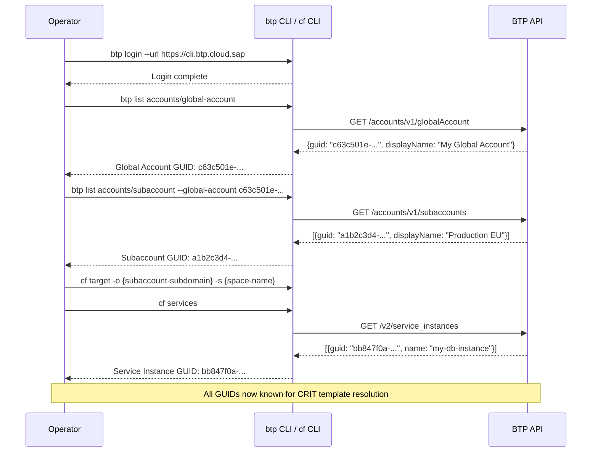

### 4.6 Proposed CRIT Template Formats

**BTP Service Instance — template format:** `sap_btp_url`

```
https://api.cf.{region}.hana.ondemand.com/v2/service_instances/{service-instance-guid}
```

**S/4HANA OData Entity — template format:** `sap_odata_url`

```
https://{host}/sap/opu/odata/sap/{service-name}/{entity-set}({object-id})
```

**SuccessFactors OData Entity — template format:** `sap_sf_url`

```
https://{api-server}.successfactors.com/odata/v2/{entity-set}({object-id})
```

**Example CRIT dictionary entries:**

```json
{ "service": "btp", "resource_type": "service-instance", "template": "https://api.cf.{region}.hana.ondemand.com/v2/service_instances/{service-instance-guid}", "template_format": "sap_btp_url", "region_behavior": "regional" },
{ "service": "s4hana", "resource_type": "business-partner", "template": "https://{host}/sap/opu/odata/sap/API_BUSINESS_PARTNER/A_BusinessPartner('{object-id}')", "template_format": "sap_odata_url", "region_behavior": "regional" },
{ "service": "successfactors", "resource_type": "employee", "template": "https://{api-server}.successfactors.com/odata/v2/EmpEmployment(personIdExternal='{object-id}')", "template_format": "sap_sf_url", "region_behavior": "regional" }
```

---

## 5. ServiceNow

### 5.1 Resource Model

ServiceNow's model is elegantly simple: every resource is a row in a table, identified by a `sys_id`. The instance hostname provides global scoping.

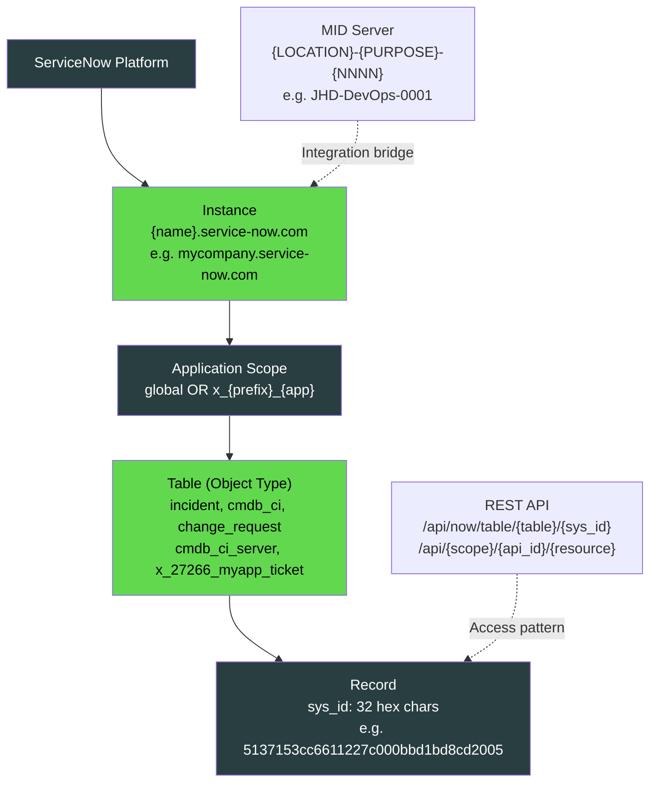

### 5.2 Identifier Anatomy

#### 5.2.1 sys_id

The `sys_id` is the universal primary key for every record in every ServiceNow table.

```
5 1 3 7 1 5 3 c c 6 6 1 1 2 2 7 c 0 0 0 b b d 1 b d 8 c d 2 0 0 5
^ ^ ^ ^ ^ ^ ^ ^ ^ ^ ^ ^ ^ ^ ^ ^ ^ ^ ^ ^ ^ ^ ^ ^ ^ ^ ^ ^ ^ ^ ^ ^
|_______________________________________________________________|
32 hexadecimal characters (0–9, a–f)
= 128 bits = UUID (stored without hyphens)

Generated from:
  - Date and time of record insertion
  - Instance-specific entropy (server IP, instance name)
  - Pseudo-random component
Guarantees global uniqueness across ALL ServiceNow instances worldwide
```

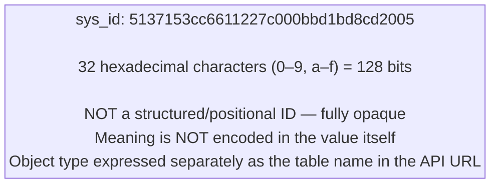

#### 5.2.2 Application Scope (Namespace)

```
x _ 2 7 2 6 6 _ h e l l o _ w o r l
^   ^^^^^^^^^^^   ^^^^^^^^^^^^^^^^^^
|       |                 |
|       |                 +-- App ID segment (up to 10 chars, auto-generated)
|       +-------------------- Vendor prefix (2–5 char customer code)
+---------------------------- Fixed literal 'x_'
```

| Scope Value | Meaning |
|---|---|
| `global` | Platform-level / system tables |
| `x_{prefix}_{appid}` | Scoped application (custom or store app) |

Scoped applications prefix ALL their artifacts: table names, script names, REST API paths.

### 5.3 Variable Segments

| Segment | Description | Format / Regex | Example |
|---|---|---|---|
| `instance` | ServiceNow instance hostname | `[a-z][a-z0-9_]{2,}` | `dev111222`, `mycompany`, `prod_acme` |
| `table` | Table name (object type) | `[a-z][a-z0-9_]*` | `incident`, `cmdb_ci`, `change_request` |
| `sys-id` | Record primary key | `[0-9a-f]{32}` | `5137153cc6611227c000bbd1bd8cd2005` |
| `scope` | Application namespace | `global\|x_[a-z0-9]{2,5}_[a-z0-9_]{1,10}` | `global`, `x_27266_hello_worl` |
| `api-id` | Scoped REST API identifier | `[a-z][a-z0-9_]*` | `my_api`, `incident_api` |
| `api-version` | REST API version | `v\d+` | `v1`, `v2` |
| `field` | Query field name | `[a-z][a-z0-9_]*` | `number`, `assigned_to`, `state` |

### 5.4 API URL Patterns

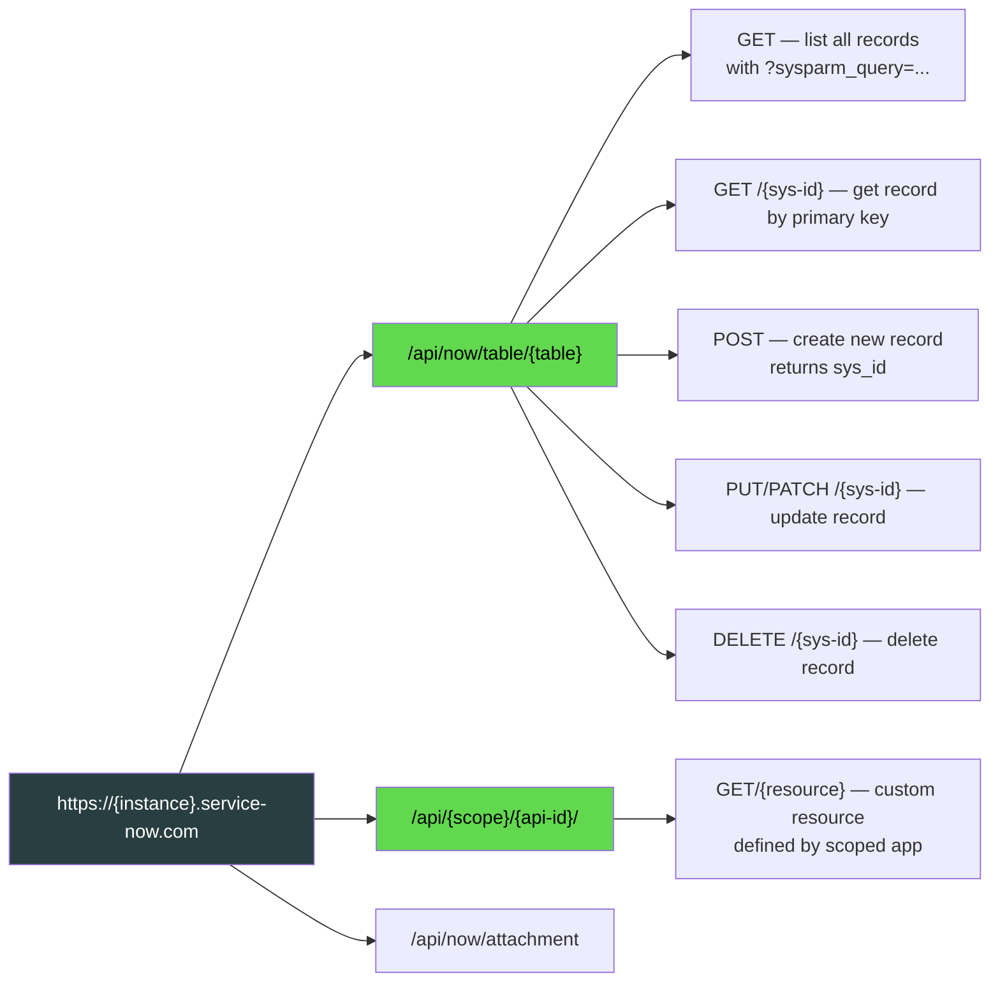

**Complete URL examples:**

| Operation | URL Pattern |
|---|---|
| Get record by sys_id | `https://{instance}.service-now.com/api/now/table/{table}/{sys-id}` |
| Query (discover sys_id) | `https://{instance}.service-now.com/api/now/table/{table}?sysparm_query={field}={value}&sysparm_fields=sys_id,number` |
| List with filter | `https://{instance}.service-now.com/api/now/table/{table}?sysparm_query=state=1^assigned_to.user_name=admin&sysparm_limit=10` |
| Scoped REST API | `https://{instance}.service-now.com/api/{scope}/{api-id}/{resource}` |
| CMDB CI | `https://{instance}.service-now.com/api/now/table/cmdb_ci/{sys-id}` |

**Key query parameters:**

| Parameter | Purpose | Example |
|---|---|---|
| `sysparm_query` | Filter expression | `state=1^priority=2` |
| `sysparm_fields` | Fields to return | `sys_id,number,short_description` |
| `sysparm_limit` | Max records | `sysparm_limit=100` |
| `sysparm_offset` | Pagination offset | `sysparm_offset=100` |
| `sysparm_display_value` | Return labels vs values | `true` or `false` |

### 5.5 Discovering a sys_id When Unknown

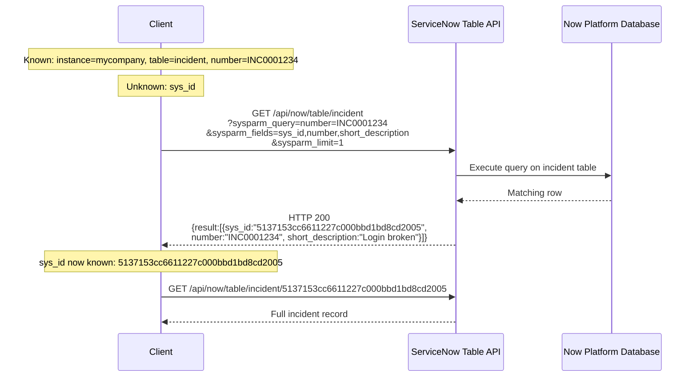

### 5.6 Proposed CRIT Template Format

**Table API — template format:** `servicenow_table_url`

```
https://{instance}.service-now.com/api/now/table/{table}/{sys-id}
```

**Scoped API — template format:** `servicenow_api_url`

```
https://{instance}.service-now.com/api/{scope}/{api-id}/{resource}
```

**Example CRIT dictionary entries:**

```json
{ "service": "itsm", "resource_type": "incident", "template": "https://{instance}.service-now.com/api/now/table/incident/{sys-id}", "template_format": "servicenow_table_url", "region_behavior": "none" },
{ "service": "itsm", "resource_type": "change-request", "template": "https://{instance}.service-now.com/api/now/table/change_request/{sys-id}", "template_format": "servicenow_table_url", "region_behavior": "none" },
{ "service": "cmdb", "resource_type": "configuration-item", "template": "https://{instance}.service-now.com/api/now/table/cmdb_ci/{sys-id}", "template_format": "servicenow_table_url", "region_behavior": "none" },
{ "service": "cmdb", "resource_type": "server", "template": "https://{instance}.service-now.com/api/now/table/cmdb_ci_server/{sys-id}", "template_format": "servicenow_table_url", "region_behavior": "none" }
```

**Note on `region_behavior`:** ServiceNow instances are not region-aware from the CRIT perspective. The instance name itself encodes the deployment, and there is no region slot in any ServiceNow identifier. Region behavior should be `"none"` for all ServiceNow entries.

---

## 6. Cross-Provider Comparison Matrix

| Dimension | AWS | Salesforce | SAP BTP | SAP S/4HANA | ServiceNow |
|---|---|---|---|---|---|
| **Canonical ID type** | ARN opaque string | 18-char base-62 positional | UUID v4 (RFC 4122) | SID + Client + ObjID tuple | 32-char hex UUID (no hyphens) |
| **Account/Tenant scope** | 12-digit Account ID | Org ID (prefix `00D`, 18-char) | Global Account GUID | Tenant ID (6–10 digit) | Instance hostname |
| **Region** | Named region (us-east-1) | Pod code (na1, eu12) | Landscape code (eu10, us10) | SID+Landscape (implicit) | None — instance is the scope |
| **Zone / sub-region** | Availability Zone | Not applicable | CF Space / Subaccount | ABAP Client | Not applicable |
| **Object/Resource type** | Service namespace in ARN | Entity key prefix (3 chars) + sObject name | Service category (BTP service type) | OData service + entity set | Table name (lowercase_underscore) |
| **Resource instance ID** | `resource-id` segment | 18-char record ID (chars 8–15 = unique) | Service instance GUID (UUID) | Object primary key (varies) | `sys_id` (32 hex chars) |
| **ID globally unique** | Yes (account+region+type+id) | Yes (org+record) | Yes (UUID) | Within landscape only | Yes (universally unique UUID) |
| **Human-readable name** | Partial (Lambda, S3 bucket names) | My Domain URL subdomain | Subaccount subdomain | SID (3-char mnemonic) | Instance hostname |
| **ID carries type info** | Yes (service segment) | Yes (3-char entity prefix) | No (UUID is opaque) | No (requires OData path) | No (requires table name in URL) |
| **Discovery API** | AWS Config / describe APIs | SOQL query `SELECT Id FROM {ObjectType}` | `btp list` CLI / CF API | OData `$filter` / SE16 | Table API `?sysparm_query=` |
| **API format** | REST + SDK | REST (SOQL) | REST (CF v2/v3) | OData v2/v4 | REST (Table API) |
| **Region behavior for CRIT** | `regional` or `global-only` | `regional` (pod-based) | `regional` (eu10, us10) | `regional` (host-based) | `none` |

---

## 7. Proposed Universal CRIT Segment Mapping

The user's proposed canonical string structure: `provider/vendor/service/product/resource/region/zone/application/instance`

This maps to CRIT fields and provider-specific identifiers as follows:

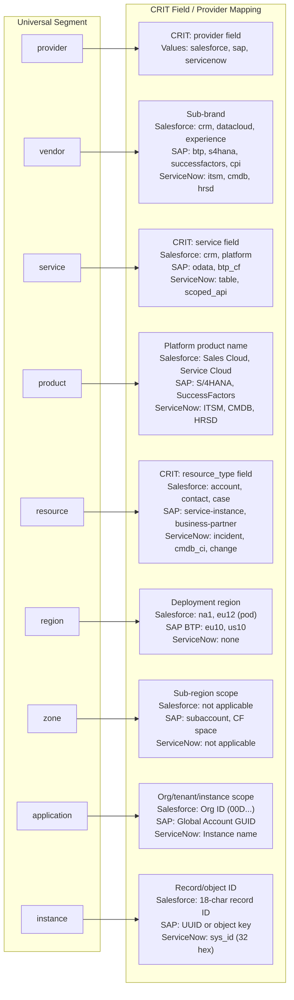

### 7.1 Canonical String Examples

Using the `provider/vendor/service/product/resource/region/zone/application/instance` pattern:

```
Salesforce Account record:
salesforce/crm/sobjects/SalesCloud/account/na1/-/00D6A000002fFTLUA2/001Rt000000RYhGIAW

SAP BTP Service Instance:
sap/btp/cf/BTP/service-instance/eu10/a1b2c3d4-.../c63c501e-.../bb847f0a-...

SAP S/4HANA Business Partner:
sap/s4hana/odata/S4HANA/business-partner/prd/-/PRD/100-00100000

ServiceNow Incident:
servicenow/itsm/table/ITSM/incident/-/-/mycompany/5137153cc6611227c000bbd1bd8cd2005
```

Note: `-` denotes a segment that is not applicable for the resource type at that position.

---

## 8. CRIT Template Recommendations

### 8.1 New `template_format` Values Required

| Template Format | Provider | Description |
|---|---|---|
| `salesforce_url` | Salesforce | REST API URL to a specific sObject record via instance URL |
| `salesforce_mydomain_url` | Salesforce | REST API URL via My Domain (custom subdomain) |
| `sap_btp_url` | SAP | BTP Cloud Foundry API URL for service instances |
| `sap_odata_url` | SAP | S/4HANA / ABAP OData service entity URL |
| `sap_sf_url` | SAP SuccessFactors | SuccessFactors OData entity URL |
| `servicenow_table_url` | ServiceNow | Table API URL (global scope) |
| `servicenow_api_url` | ServiceNow | Scoped REST API URL |

### 8.2 New Reserved Slot Names Required

To complement the existing reserved field names (region, account, resource-id), the following should be added to the CRIT reserved slot name registry:

| Slot Name | Applies To | Description |
|---|---|---|
| `instance` | Salesforce, ServiceNow | Pod hostname or instance name |
| `my-domain` | Salesforce | My Domain subdomain |
| `org-id` | Salesforce | Organization record ID (18-char, prefix 00D) |
| `api-version` | Salesforce | REST API version (e.g., v66.0) |
| `object-type` | Salesforce | sObject API name |
| `record-id` | Salesforce | 18-character record ID |
| `global-account-guid` | SAP BTP | Global Account UUID |
| `subaccount-guid` | SAP BTP | Subaccount UUID |
| `service-instance-guid` | SAP BTP | Service instance UUID |
| `sid` | SAP S/4HANA | System ID (3-char) |
| `client` | SAP S/4HANA | ABAP client number |
| `service-name` | SAP OData | OData service technical name |
| `entity-set` | SAP OData | OData entity set name |
| `api-server` | SAP SuccessFactors | Data-center API hostname |
| `table` | ServiceNow | Table name (object type) |
| `sys-id` | ServiceNow | Record sys_id (32 hex chars) |
| `scope` | ServiceNow | Application scope namespace |
| `api-id` | ServiceNow | Scoped API identifier |

### 8.3 Region Behavior Summary

| Provider / Platform | `region_behavior` | Notes |
|---|---|---|
| Salesforce | `regional` | Pod encodes region; use `{instance}` slot |
| SAP BTP | `regional` | Explicit `{region}` slot (eu10, us10) |
| SAP S/4HANA | `regional` | Region expressed via `{host}` (FQDN); no formal region slot |
| SAP SuccessFactors | `regional` | `{api-server}` encodes region implicitly |
| ServiceNow | `none` | No region concept; instance is globally unique |

### 8.4 Wordlist Requirements for Test Fixtures

New wordlist files needed under `tests/wordlists/`:

```
tests/wordlists/salesforce/instance.txt      # na1, eu1, ap1, cs1, gs0, ...
tests/wordlists/salesforce/org-id.txt        # 18-char Org IDs (00D prefix)
tests/wordlists/salesforce/record-id.txt     # 18-char record IDs (various prefixes)
tests/wordlists/salesforce/object-type.txt   # Account, Contact, Case, Opportunity, ...
tests/wordlists/sap/region.txt               # eu10, us10, ap21, jp10, br10, ...
tests/wordlists/sap/global-account-guid.txt  # UUID v4 examples
tests/wordlists/sap/sid.txt                  # PRD, DEV, QAS, ...
tests/wordlists/sap/client.txt               # 100, 200, 800, ...
tests/wordlists/sap/api-server.txt           # api4, api8, api012, ...
tests/wordlists/servicenow/instance.txt      # dev111222, mycompany, ...
tests/wordlists/servicenow/sys-id.txt        # 32-hex-char sys_ids
tests/wordlists/servicenow/table.txt         # incident, cmdb_ci, change_request, ...
```

---

## Sources

### Salesforce
- [Salesforce 15 vs 18 Digit ID Differences](https://www.nickfrates.com/blog/salesforce-15-vs-18-digit-id-differences-conversion-guide)
- [Demystifying Salesforce IDs](https://medium.com/@vishwakarmaas27/demystifying-salesforce-ids-b378820aa631)
- [Salesforce Entity Key Prefix Decoder](https://help.salesforce.com/s/articleView?id=000385203&language=en_US&type=1)
- [REST API Developer Guide (Spring '26)](https://resources.docs.salesforce.com/latest/latest/en-us/sfdc/pdf/api_rest.pdf)
- [My Domain URL Formats](https://help.salesforce.com/s/articleView?id=sf.domain_name_url_formats.htm&language=en_US&type=5)
- [Find Your Salesforce Organization ID](https://help.salesforce.com/s/articleView?id=000385215&language=en_US&type=1)
- [Salesforce Object ID 3-char expansion (Summer '23)](https://help.salesforce.com/s/articleView?id=release-notes.rn_hyperforce_object_id.htm&language=en_US&release=246&type=5)

### SAP
- [SAP BTP Account Model](https://help.sap.com/docs/btp/sap-business-technology-platform/account-model)
- [Getting BTP Resource GUIDs with btp CLI](https://qmacro.org/blog/posts/2021/11/24/getting-btp-resource-guids-with-the-btp-cli-part-1/)
- [SAP Help Portal — Choosing SAP System IDs](https://help.sap.com/docs/Convergent_Charging/d1d04c0d65964a9b91589ae7afc1bd45/bcec108560b441c1bff4ec3df9810996.html)
- [SAP OData URL Conventions](https://sapbit.io/odata/urls.html)
- [SAP BTP Subaccount GUID (SAP Note 3446283)](https://userapps.support.sap.com/sap/support/knowledge/en/3446283)
- [SAP Global Account ID (SAP Note 3298097)](https://userapps.support.sap.com/sap/support/knowledge/en/3298097)
- [SAP CPI Naming Conventions](https://community.sap.com/t5/technology-blog-posts-by-members/a-practical-guide-to-naming-iflows-in-sap-cloud-integration-sci/ba-p/13885657)

### ServiceNow
- [Unique record identifier (sys_id)](https://www.servicenow.com/docs/bundle/zurich-platform-administration/page/administer/table-administration/concept/c_UniqueRecordIdentifier.html)
- [What's so unique about the sys_id?](https://sys.properties/2024/09/17/whats-so-unique-about-the-sys_id/)
- [ServiceNow REST API Reference](https://www.servicenow.com/docs/bundle/zurich-api-reference/page/build/applications/concept/api-rest.html)
- [Understanding Application Scope on the Now Platform](https://www.servicenow.com/community/developer-articles/understanding-application-scope-on-the-now-platform-whitepaper/ta-p/2326214)
- [Table API FAQs](https://support.servicenow.com/kb?id=kb_article_view&sysparm_article=KB0534905)
- [MID Server naming conventions](https://support.servicenow.com/kb?id=kb_article_view&sysparm_article=KB0952302)
- [CI Identification Rules — CMDB Data Quality](https://www.servicenow.com/community/cmdb-articles/elevating-cmdb-data-quality-with-well-defined-ci-identification/ta-p/2857355)
