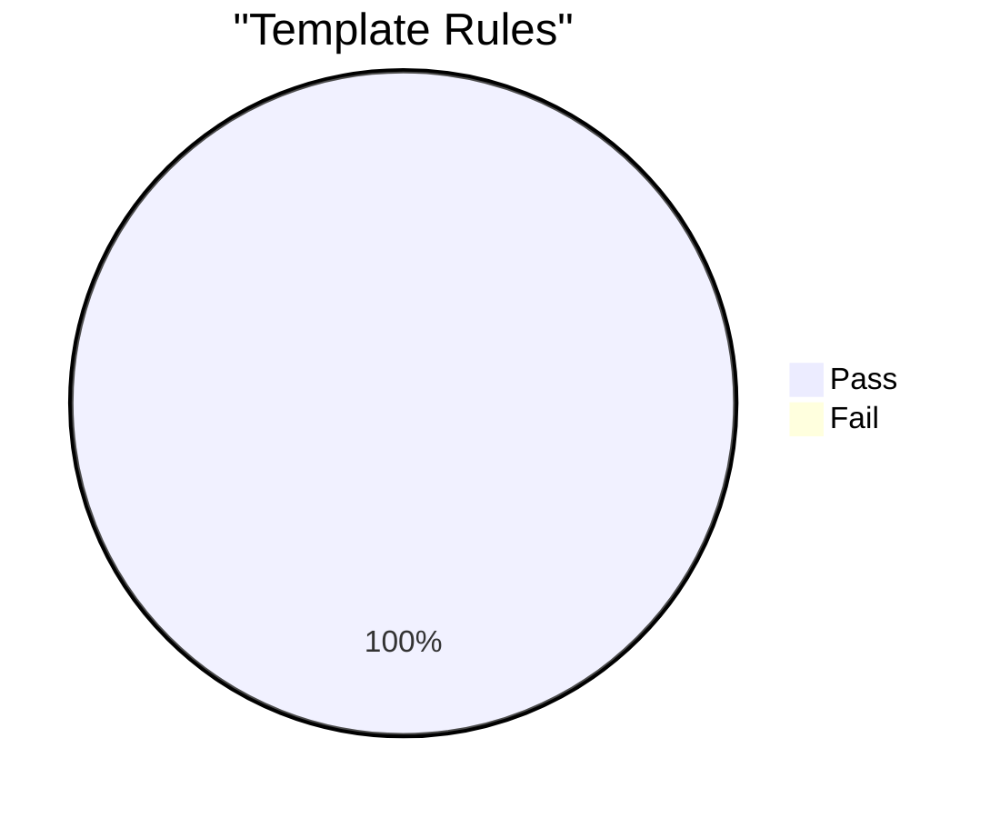
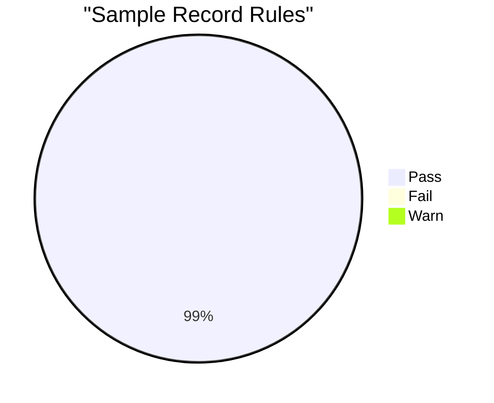

# CRIT Spec Conformance Report

**Date:** 2026-03-22 14:12:40 UTC  
**Verdict:** WARN  
**Total Checks:** 52620 | **Passed:** 52607 | **Failed:** 0 | **Warnings:** 13  

## Summary

| Suite | Rules | Samples | Checks | Passed | Failed | Warnings |
|-------|------:|--------:|-------:|-------:|-------:|---------:|
| Template Rules | 20 | 2565 | 51300 | 51300 | 0 | 0 |
| Sample Record Rules | 40 | 33 | 1320 | 1307 | 0 | 13 |

## Template Rules

### Rule Results

| Status | Sec | Rule | Pass | Fail | Requirement |
|:------:|:---:|------|-----:|-----:|-------------|
| PASS | 3.2 | `slot-delimiter-not-in-literal` | 2565 | 0 | Characters { and } MUST NOT appear outside slot expressions |
| PASS | 3.3.1 | `named-var-no-default` | 2565 | 0 | Named variable MUST NOT be treated as implying any default value |
| PASS | 3.3.1 | `named-var-requires-substitution` | 2565 | 0 | Named variable MUST substitute concrete value before using template as live identifier |
| PASS | 3.3.2 | `wildcard-not-live-identifier` | 2565 | 0 | Wildcard MUST NOT be used as live identifier against provider API |
| PASS | 3.3.4 | `hardcoded-value-as-is` | 2565 | 0 | Consumer MUST use hardcoded value as-is; MUST NOT substitute alternative value |
| PASS | 3.4 | `slot-state-precedence` | 2565 | 0 | Producer MUST select slot state according to precedence |
| PASS | 3.4 | `wildcard-not-fallback` | 2565 | 0 | Producer MUST NOT use wildcard as fallback when correct state is unknown |
| PASS | 3.2 | `template-produces-valid-id` | 2565 | 0 | Conformant CRIT template MUST produce valid identifier after variable resolution |
| PASS | 6.1 | `aws-global-region-hardcoded` | 2565 | 0 | AWS global-only services: region MUST be hardcoded to us-east-1 |
| PASS | 6.1 | `aws-regional-region-variable` | 2565 | 0 | AWS regional services: region MUST be named variable or wildcard, MUST NOT be empty |
| PASS | 6.4 | `cloudflare-no-region-slot` | 2565 | 0 | Producer MUST NOT add region slot to Cloudflare templates |
| PASS | 7.1 | `resolution-produces-valid-id` | 2565 | 0 | After variable resolution, result MUST be valid provider identifier |
| PASS | 7.2 | `reserved-field-names-used` | 2565 | 0 | Producer MUST use reserved field names where applicable |
| PASS | 5 | `template-field-valid-after-resolution` | 2565 | 0 | After all named variables substituted, result MUST be valid provider identifier for declared template_format |
| PASS | 12.2 | `dictionary-entry-required-fields` | 2565 | 0 | All fields except notes are REQUIRED in dictionary entry |
| PASS | 12.1.1 | `dictionary-tuple-resolves` | 2565 | 0 | (provider, service, resource_type) tuple MUST resolve to entry in conformant dictionary |
| PASS | 9.1 | `service-key-lowercase-underscore` | 2565 | 0 | service field MUST match pattern ^[a-z][a-z0-9_]*$ |
| PASS | 9.1 | `resource-type-valid-pattern` | 2565 | 0 | resource_type MUST match pattern ^[a-zA-Z][a-zA-Z0-9_/-]*$ |
| PASS | 9.1 | `template-format-matches-provider` | 2565 | 0 | template_format MUST match provider |
| PASS | 3.2 | `slot-syntax-abnf-valid` | 2565 | 0 | All slots MUST conform to ABNF grammar: field-name = 1*(ALPHA / DIGIT / "-" / "_") |

## Sample Record Rules

### Failures by Provider

| Provider | Failed | Warnings |
|----------|-------:|---------:|
| aws | 0 | 4 |
| azure | 0 | 3 |
| gcp | 0 | 2 |
| cloudflare | 0 | 1 |
| oracle | 0 | 3 |

### Rule Results

| Status | Level | Sec | Rule | Pass | Fail | Warn | Requirement |
|:------:|:-----:|:---:|------|-----:|-----:|-----:|-------------|
| PASS | MUST | 4.1 | `dates-iso8601-format` | 33 | 0 | 0 | All date fields in temporal MUST be ISO 8601 full-date (YYYY-MM-DD) |
| PASS | MUST | 4.1 | `natural-key-fields-present` | 33 | 0 | 0 | vuln_id, provider, service, resource_type MUST all be non-empty |
| PASS | MUST | 9.1 | `service-key-lowercase-underscore` | 33 | 0 | 0 | service MUST match ^[a-z][a-z0-9_]*$ |
| PASS | MUST | 9.1 | `resource-type-valid-pattern` | 33 | 0 | 0 | resource_type MUST match ^[a-zA-Z][a-zA-Z0-9_/-]*$ |
| PASS | MUST | 9.1 | `template-format-matches-provider` | 33 | 0 | 0 | template_format MUST match provider |
| PASS | MUST | 3.2 | `slot-syntax-abnf-valid` | 33 | 0 | 0 | All slots MUST conform to ABNF grammar |
| PASS | MUST | 3.2 | `slot-delimiter-not-in-literal` | 33 | 0 | 0 | { and } MUST NOT appear outside slot expressions |
| PASS | MUST | 6.1 | `aws-global-region-hardcoded` | 33 | 0 | 0 | AWS global-only: region MUST be hardcoded to us-east-1 |
| PASS | MUST | 6.1 | `aws-regional-region-variable` | 33 | 0 | 0 | AWS regional: region MUST be named-variable, MUST NOT be empty |
| PASS | MUST | 6.4 | `cloudflare-no-region-slot` | 33 | 0 | 0 | Cloudflare templates MUST NOT have region slot |
| PASS | MUST | 12.1.1 | `dictionary-tuple-resolves` | 33 | 0 | 0 | (provider, service, resource_type) MUST resolve in dictionary |
| PASS | MUST | 4.3 | `customer-deadline-source-required` | 33 | 0 | 0 | customer_deadline_source REQUIRED when customer_deadline_date present |
| PASS | MUST | 4.3 | `introduced-not-after-published` | 33 | 0 | 0 | vulnerability_introduced_date MUST NOT be after vuln_published_date |
| PASS | MUST | 4.4.1 | `false-only-when-auto-provider` | 33 | 0 | 0 | existing_deployments_remain_vulnerable=false ONLY when automatic+provider_only |
| PASS | MUST | 4.4.2 | `no-fix-no-provider-fix-date` | 33 | 0 | 0 | no_fix_available -> provider_fix_date MUST be absent |
| PASS | MUST | 8.2 | `provider-only-fix-not-vulnerable` | 33 | 0 | 0 | provider_only + fix_date -> existing_deployments_remain_vulnerable MUST be false |
| PASS | MUST | 4.4.3 | `sequence-unique-contiguous` | 33 | 0 | 0 | remediation_actions sequence MUST be unique and contiguous from 1 |
| PASS | MUST | 4.4.3 | `downtime-range-when-required` | 33 | 0 | 0 | estimated_downtime_range_seconds REQUIRED when requires_downtime=true |
| PASS | MUST | 4.4.3 | `compensating-only-means-affected` | 33 | 0 | 0 | All compensating actions -> vex_status MUST be affected |
| PASS | MUST | 9.1 | `remediation-actions-present` | 33 | 0 | 0 | At least one remediation_actions for vex_status=affected or fixed |
| PASS | MUST | 4.5.1 | `auto-upgrade-false-means-vulnerable` | 33 | 0 | 0 | auto_upgrade=false -> existing_deployments_remain_vulnerable MUST be true |
| WARN | SHOULD | 4.6 | `detection-recommended` | 20 | 0 | 13 | vex_status=affected or fixed SHOULD include >=1 detection entry |
| PASS | MUST | 4.6.3 | `misconfiguration-detection-for-opt-in` | 33 | 0 | 0 | opt_in or config_change MUST include misconfiguration-phase detection (placeholder with pending_reason accepted) |
| PASS | MUST | 4.6.4 | `pending-reason-enum` | 33 | 0 | 0 | pending_reason MUST be a valid enum value when present |
| PASS | MUST | 4.6.4 | `pending-reason-empty-query` | 33 | 0 | 0 | query MUST be empty string when pending_reason is set |
| PASS | MUST | 4.6.4 | `no-empty-query-without-pending` | 33 | 0 | 0 | functional detection with empty query requires pending_reason |
| PASS | MUST | 4.1.2 | `vector-string-parseable` | 33 | 0 | 0 | vectorString MUST be a parseable CRIT vector with valid known metrics |
| PASS | MUST | 4.1.2 | `vector-provider-matches` | 33 | 0 | 0 | CP metric MUST match record provider field |
| PASS | MUST | 4.1.2 | `vector-vex-matches` | 33 | 0 | 0 | VS metric MUST match record vex_status field |
| PASS | MUST | 4.1.2 | `vector-propagation-matches` | 33 | 0 | 0 | FP metric MUST match record fix_propagation field |
| PASS | MUST | 4.1.2 | `vector-responsibility-matches` | 33 | 0 | 0 | SR metric MUST match record shared_responsibility field |
| PASS | MUST | 4.1.2 | `vector-lifecycle-matches` | 33 | 0 | 0 | RL metric MUST match record resource_lifecycle field |
| PASS | MUST | 4.1.2 | `vector-existing-vuln-matches` | 33 | 0 | 0 | EV metric MUST match record existing_deployments_remain_vulnerable field |
| PASS | MUST | 4.1.2 | `vector-qualifiers-match` | 33 | 0 | 0 | vector qualifiers MUST match record vuln_id, service, resource_type |
| PASS | MUST | 4.1.2 | `vector-string-canonical` | 33 | 0 | 0 | vectorString MUST match canonical vector computed from record fields |
| PASS | MUST | 4.1.2 | `vector-published-matches` | 33 | 0 | 0 | PP epoch MUST match temporal.vuln_published_date converted to UTC epoch |
| PASS | MUST | 4.1.2 | `vector-service-avail-matches` | 33 | 0 | 0 | SA epoch MUST match temporal.service_available_date converted to UTC epoch |
| PASS | MUST | 4.1.2 | `vector-metrics-order` | 33 | 0 | 0 | registered metrics MUST appear in canonical order CP VS FP SR RL EV PP SA |
| PASS | MUST | 4.1.2 | `vector-unknown-tolerated` | 33 | 0 | 0 | consumer MUST NOT reject vectors with unknown metric keys |
| PASS | MUST | 4.1.2 | `vector-missing-registered-rejected` | 33 | 0 | 0 | consumer MUST reject vectors missing a registered metric |

### Failures & Warnings

#### `detection-recommended` (4.6) &mdash; 13 warnings

| Provider | Service | Resource Type | Detail |
|----------|---------|---------------|--------|
| aws | lambda | function | vex_status=fixed but no detections |
| aws | elb | loadbalancer | vex_status=fixed but no detections |
| aws | ec2 | instance | vex_status=fixed but no detections |
| aws | eks | cluster | vex_status=fixed but no detections |
| azure | app_service | sites | vex_status=fixed but no detections |
| azure | load_balancer | loadBalancers | vex_status=fixed but no detections |
| azure | kubernetes_service | managedClusters | vex_status=fixed but no detections |
| cloudflare | dns | zone | vex_status=fixed but no detections |
| gcp | compute | instance | vex_status=fixed but no detections |
| gcp | kubernetes_engine | cluster | vex_status=fixed but no detections |
| oracle | autonomous_database | autonomousdatabase | vex_status=fixed but no detections |
| oracle | autonomous_database | autonomousdatabase | vex_status=fixed but no detections |
| oracle | oke | cluster | vex_status=fixed but no detections |

---

*Generated by `crit-test` from [draft-vulnetix-crit-00](../drafts/draft-vulnetix-crit-00.xml)*
