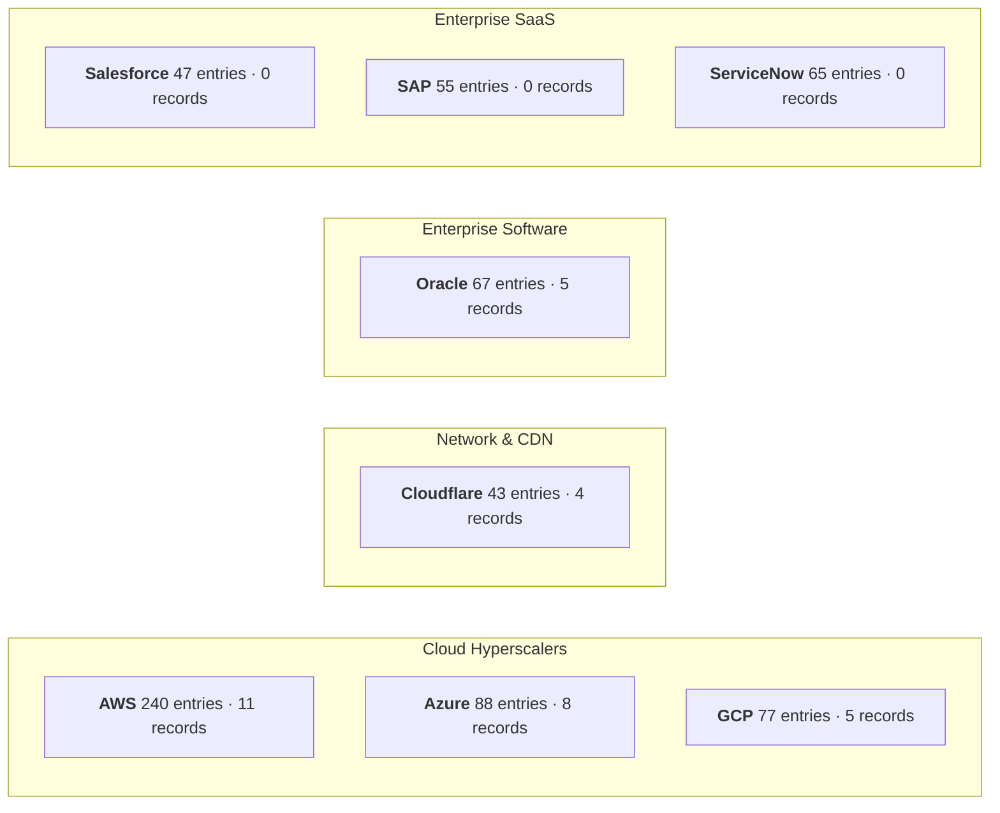
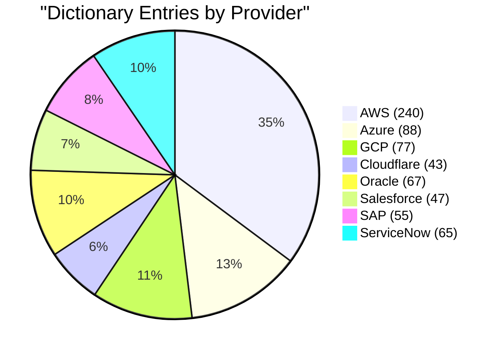
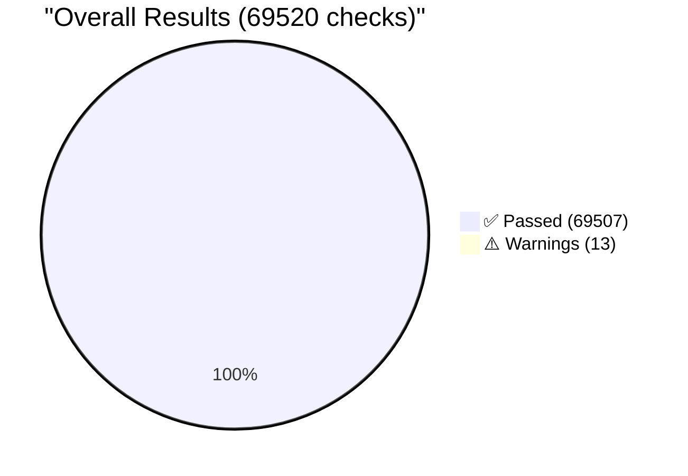
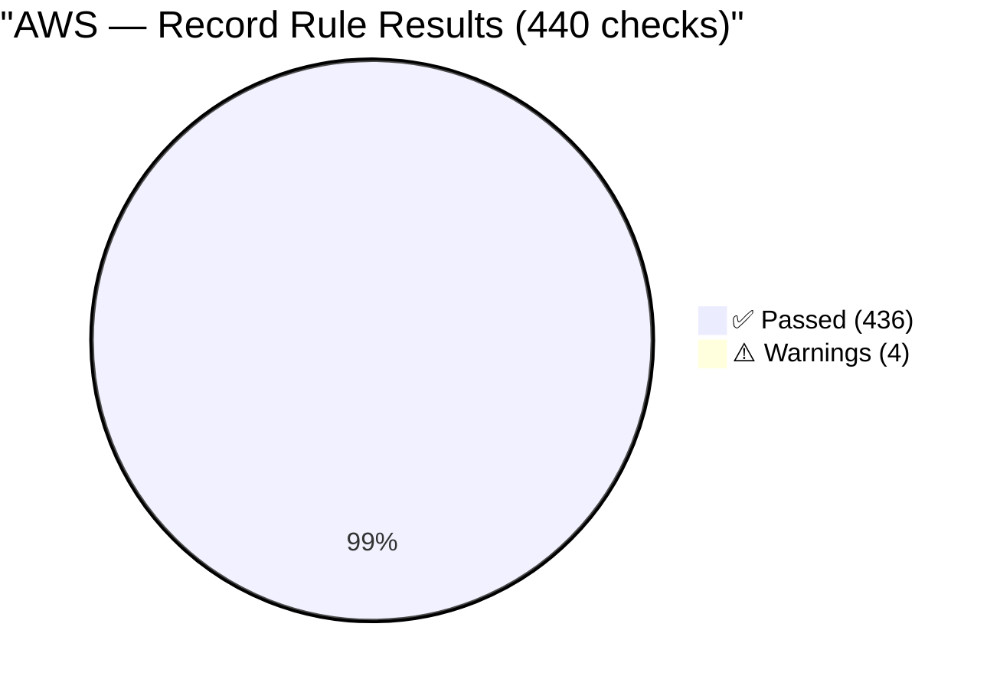
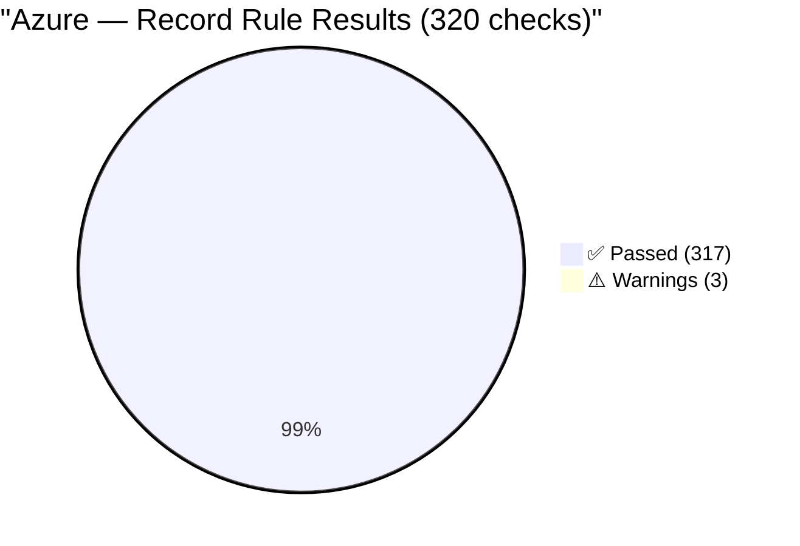
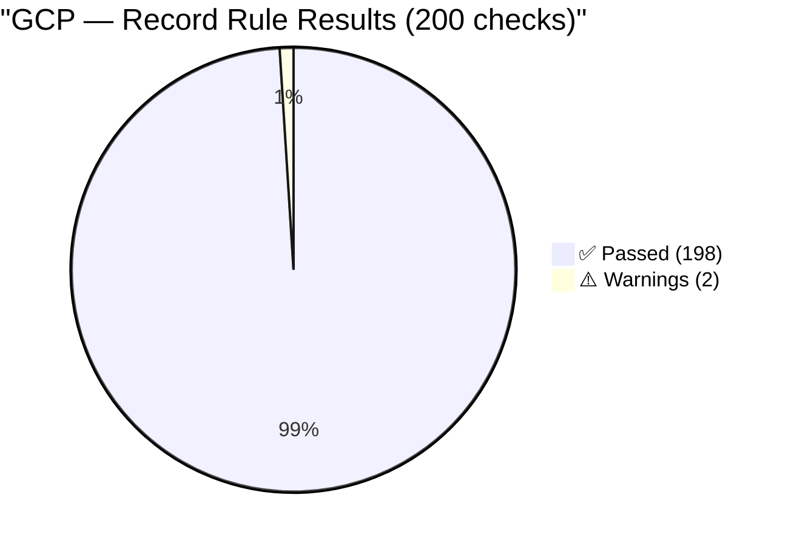
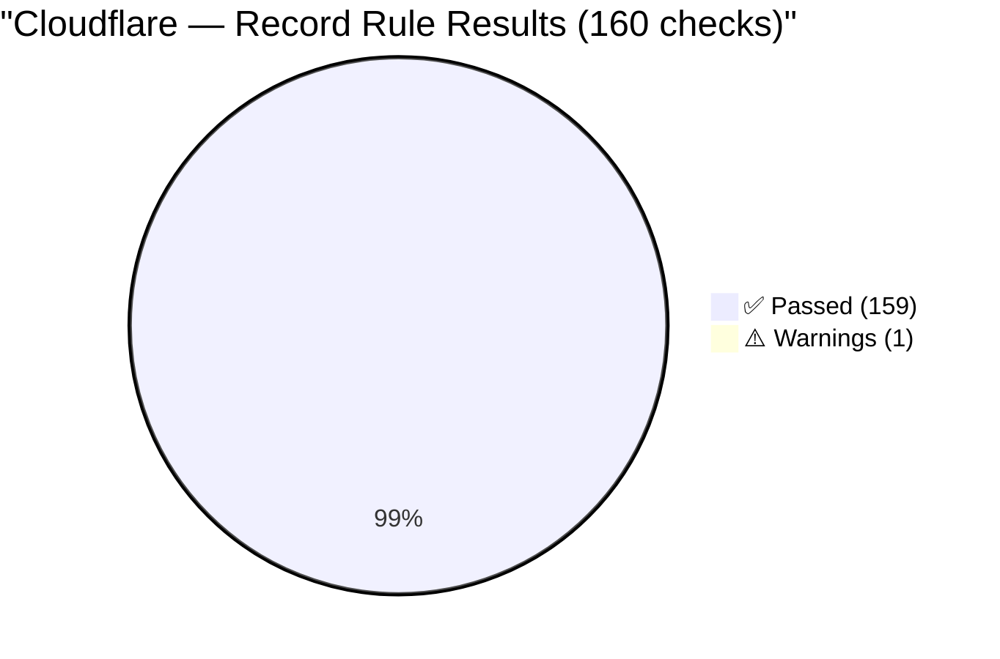
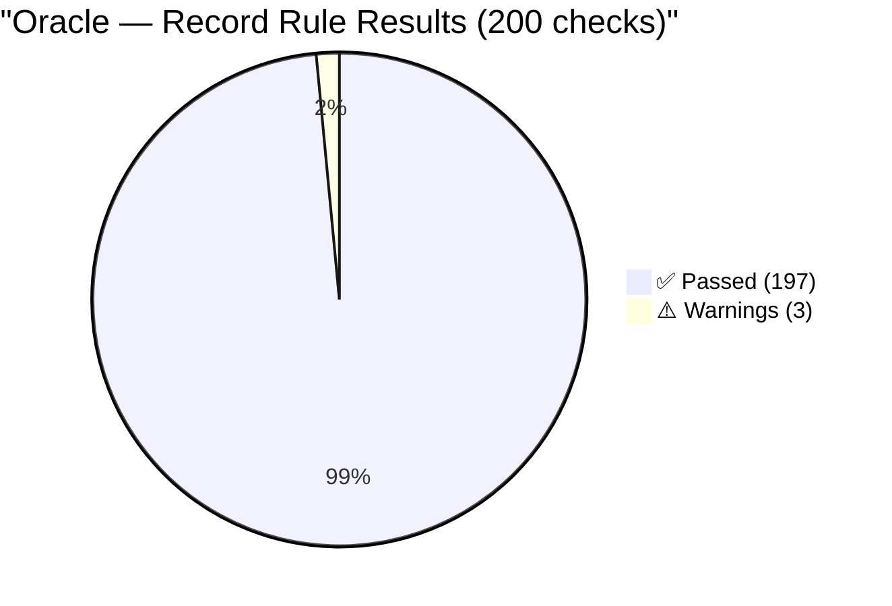

# CRIT Spec Conformance Report

## Context

This report validates CRIT dictionary entries and sample records against [draft-vulnetix-crit-00](../drafts/draft-vulnetix-crit-00.xml).

**Date:** 2026-05-06 21:35:52 UTC  
**Verdict:** ⚠️ WARN  
**Total Checks:** 69520 | ✅ **Passed:** 69507 | ❌ **Failed:** 0 | ⚠️ **Warnings:** 13  

| Provider | Dictionary Entries | Template Samples | Sample Records |
|----------|------------------:|----------------:|---------------:|
| AWS | 240 | 1200 | 11 |
| Azure | 88 | 440 | 8 |
| GCP | 77 | 385 | 5 |
| Cloudflare | 43 | 215 | 4 |
| Oracle | 67 | 335 | 5 |
| Salesforce | 47 | 235 | 0 |
| SAP | 55 | 275 | 0 |
| ServiceNow | 65 | 325 | 0 |
| **Total** | **682** | **3410** | **33** |

## Summary

| Suite | Rules | Samples | Checks | ✅ Passed | ❌ Failed | ⚠️ Warnings |
|-------|------:|--------:|-------:|----------:|----------:|------------:|
| Template Rules | 20 | 3410 | 68200 | 68200 | 0 | 0 |
| Sample Record Rules | 40 | 33 | 1320 | 1307 | 0 | 13 |

## AWS

> 240 dictionary entries · 1200 template samples · 11 sample records

### Template Rules

| Status | Sec | Rule | ✅ Pass | ❌ Fail | Requirement |
|:------:|:---:|------|-------:|-------:|-------------|
| ✅ | 3.2 | `slot-delimiter-not-in-literal` | 1200 | 0 | Characters { and } MUST NOT appear outside slot expressions |
| ✅ | 3.3.1 | `named-var-no-default` | 1200 | 0 | Named variable MUST NOT be treated as implying any default value |
| ✅ | 3.3.1 | `named-var-requires-substitution` | 1200 | 0 | Named variable MUST substitute concrete value before using template as live identifier |
| ✅ | 3.3.2 | `wildcard-not-live-identifier` | 1200 | 0 | Wildcard MUST NOT be used as live identifier against provider API |
| ✅ | 3.3.4 | `hardcoded-value-as-is` | 1200 | 0 | Consumer MUST use hardcoded value as-is; MUST NOT substitute alternative value |
| ✅ | 3.4 | `slot-state-precedence` | 1200 | 0 | Producer MUST select slot state according to precedence |
| ✅ | 3.4 | `wildcard-not-fallback` | 1200 | 0 | Producer MUST NOT use wildcard as fallback when correct state is unknown |
| ✅ | 3.2 | `template-produces-valid-id` | 1200 | 0 | Conformant CRIT template MUST produce valid identifier after variable resolution |
| ✅ | 6.1 | `aws-global-region-hardcoded` | 1200 | 0 | AWS global-only services: region MUST be hardcoded to us-east-1 or empty |
| ✅ | 6.1 | `aws-regional-region-variable` | 1200 | 0 | AWS regional services: region MUST be named variable or wildcard, MUST NOT be empty |
| ✅ | 6.4 | `cloudflare-no-region-slot` | 1200 | 0 | Producer MUST NOT add region slot to Cloudflare templates |
| ✅ | 7.1 | `resolution-produces-valid-id` | 1200 | 0 | After variable resolution, result MUST be valid provider identifier |
| ✅ | 7.2 | `reserved-field-names-used` | 1200 | 0 | Producer MUST use reserved field names where applicable |
| ✅ | 5 | `template-field-valid-after-resolution` | 1200 | 0 | After all named variables substituted, result MUST be valid provider identifier for declared template_format |
| ✅ | 12.2 | `dictionary-entry-required-fields` | 1200 | 0 | All fields except notes are REQUIRED in dictionary entry |
| ✅ | 12.1.1 | `dictionary-tuple-resolves` | 1200 | 0 | (provider, service, resource_type) tuple MUST resolve to entry in conformant dictionary |
| ✅ | 9.1 | `service-key-lowercase-underscore` | 1200 | 0 | service field MUST match pattern ^[a-z][a-z0-9_]*$ |
| ✅ | 9.1 | `resource-type-valid-pattern` | 1200 | 0 | resource_type MUST match pattern ^[a-zA-Z][a-zA-Z0-9_/-]*$ |
| ✅ | 9.1 | `template-format-matches-provider` | 1200 | 0 | template_format MUST match provider |
| ✅ | 3.2 | `slot-syntax-abnf-valid` | 1200 | 0 | All slots MUST conform to ABNF grammar: field-name = 1*(ALPHA / DIGIT / "-" / "_") |

### Sample Record Rules

| Status | Level | Sec | Rule | ✅ Pass | ❌ Fail | ⚠️ Warn | Requirement |
|:------:|:-----:|:---:|------|-------:|-------:|--------:|-------------|
| ✅ | MUST | 4.1 | `dates-iso8601-format` | 11 | 0 | 0 | All date fields in temporal MUST be ISO 8601 full-date (YYYY-MM-DD) |
| ✅ | MUST | 4.1 | `natural-key-fields-present` | 11 | 0 | 0 | vuln_id, provider, service, resource_type MUST all be non-empty |
| ✅ | MUST | 9.1 | `service-key-lowercase-underscore` | 11 | 0 | 0 | service MUST match ^[a-z][a-z0-9_]*$ |
| ✅ | MUST | 9.1 | `resource-type-valid-pattern` | 11 | 0 | 0 | resource_type MUST match ^[a-zA-Z][a-zA-Z0-9_/-]*$ |
| ✅ | MUST | 9.1 | `template-format-matches-provider` | 11 | 0 | 0 | template_format MUST match provider |
| ✅ | MUST | 3.2 | `slot-syntax-abnf-valid` | 11 | 0 | 0 | All slots MUST conform to ABNF grammar |
| ✅ | MUST | 3.2 | `slot-delimiter-not-in-literal` | 11 | 0 | 0 | { and } MUST NOT appear outside slot expressions |
| ✅ | MUST | 6.1 | `aws-global-region-hardcoded` | 11 | 0 | 0 | AWS global-only: region MUST be hardcoded to us-east-1 or empty |
| ✅ | MUST | 6.1 | `aws-regional-region-variable` | 11 | 0 | 0 | AWS regional: region MUST be named-variable, MUST NOT be empty |
| ✅ | MUST | 6.4 | `cloudflare-no-region-slot` | 11 | 0 | 0 | Cloudflare templates MUST NOT have region slot |
| ✅ | MUST | 12.1.1 | `dictionary-tuple-resolves` | 11 | 0 | 0 | (provider, service, resource_type) MUST resolve in dictionary |
| ✅ | MUST | 4.3 | `customer-deadline-source-required` | 11 | 0 | 0 | customer_deadline_source REQUIRED when customer_deadline_date present |
| ✅ | MUST | 4.3 | `introduced-not-after-published` | 11 | 0 | 0 | vulnerability_introduced_date MUST NOT be after vuln_published_date |
| ✅ | MUST | 4.4.1 | `false-only-when-auto-provider` | 11 | 0 | 0 | existing_deployments_remain_vulnerable=false ONLY when automatic+provider_only |
| ✅ | MUST | 4.4.2 | `no-fix-no-provider-fix-date` | 11 | 0 | 0 | no_fix_available -> provider_fix_date MUST be absent |
| ✅ | MUST | 8.2 | `provider-only-fix-not-vulnerable` | 11 | 0 | 0 | provider_only + fix_date -> existing_deployments_remain_vulnerable MUST be false |
| ✅ | MUST | 4.4.3 | `sequence-unique-contiguous` | 11 | 0 | 0 | remediation_actions sequence MUST be unique and contiguous from 1 |
| ✅ | MUST | 4.4.3 | `downtime-range-when-required` | 11 | 0 | 0 | estimated_downtime_range_seconds REQUIRED when requires_downtime=true |
| ✅ | MUST | 4.4.3 | `compensating-only-means-affected` | 11 | 0 | 0 | All compensating actions -> vex_status MUST be affected |
| ✅ | MUST | 9.1 | `remediation-actions-present` | 11 | 0 | 0 | At least one remediation_actions for vex_status=affected or fixed |
| ✅ | MUST | 4.5.1 | `auto-upgrade-false-means-vulnerable` | 11 | 0 | 0 | auto_upgrade=false -> existing_deployments_remain_vulnerable MUST be true |
| ⚠️ | SHOULD | 4.6 | `detection-recommended` | 7 | 0 | 4 | vex_status=affected or fixed SHOULD include >=1 detection entry |
| ✅ | MUST | 4.6.3 | `misconfiguration-detection-for-opt-in` | 11 | 0 | 0 | opt_in or config_change MUST include misconfiguration-phase detection (placeholder with pending_reason accepted) |
| ✅ | MUST | 4.6.4 | `pending-reason-enum` | 11 | 0 | 0 | pending_reason MUST be a valid enum value when present |
| ✅ | MUST | 4.6.4 | `pending-reason-empty-query` | 11 | 0 | 0 | query MUST be empty string when pending_reason is set |
| ✅ | MUST | 4.6.4 | `no-empty-query-without-pending` | 11 | 0 | 0 | functional detection with empty query requires pending_reason |
| ✅ | MUST | 4.1.2 | `vector-string-parseable` | 11 | 0 | 0 | vectorString MUST be a parseable CRIT vector with valid known metrics |
| ✅ | MUST | 4.1.2 | `vector-provider-matches` | 11 | 0 | 0 | CP metric MUST match record provider field |
| ✅ | MUST | 4.1.2 | `vector-vex-matches` | 11 | 0 | 0 | VS metric MUST match record vex_status field |
| ✅ | MUST | 4.1.2 | `vector-propagation-matches` | 11 | 0 | 0 | FP metric MUST match record fix_propagation field |
| ✅ | MUST | 4.1.2 | `vector-responsibility-matches` | 11 | 0 | 0 | SR metric MUST match record shared_responsibility field |
| ✅ | MUST | 4.1.2 | `vector-lifecycle-matches` | 11 | 0 | 0 | RL metric MUST match record resource_lifecycle field |
| ✅ | MUST | 4.1.2 | `vector-existing-vuln-matches` | 11 | 0 | 0 | EV metric MUST match record existing_deployments_remain_vulnerable field |
| ✅ | MUST | 4.1.2 | `vector-qualifiers-match` | 11 | 0 | 0 | vector qualifiers MUST match record vuln_id, service, resource_type |
| ✅ | MUST | 4.1.2 | `vector-string-canonical` | 11 | 0 | 0 | vectorString MUST match canonical vector computed from record fields |
| ✅ | MUST | 4.1.2 | `vector-published-matches` | 11 | 0 | 0 | PP epoch MUST match temporal.vuln_published_date converted to UTC epoch |
| ✅ | MUST | 4.1.2 | `vector-service-avail-matches` | 11 | 0 | 0 | SA epoch MUST match temporal.service_available_date converted to UTC epoch |
| ✅ | MUST | 4.1.2 | `vector-metrics-order` | 11 | 0 | 0 | registered metrics MUST appear in canonical order CP VS FP SR RL EV PP SA |
| ✅ | MUST | 4.1.2 | `vector-unknown-tolerated` | 11 | 0 | 0 | consumer MUST NOT reject vectors with unknown metric keys |
| ✅ | MUST | 4.1.2 | `vector-missing-registered-rejected` | 11 | 0 | 0 | consumer MUST reject vectors missing a registered metric |

### Failures & Warnings

#### `detection-recommended` (4.6) &mdash; 4 ⚠️ warnings

| Service | Resource Type | Detail |
|---------|---------------|--------|
| lambda | function | vex_status=fixed but no detections |
| elb | loadbalancer | vex_status=fixed but no detections |
| ec2 | instance | vex_status=fixed but no detections |
| eks | cluster | vex_status=fixed but no detections |

## Azure

> 88 dictionary entries · 440 template samples · 8 sample records

### Template Rules

| Status | Sec | Rule | ✅ Pass | ❌ Fail | Requirement |
|:------:|:---:|------|-------:|-------:|-------------|
| ✅ | 3.2 | `slot-delimiter-not-in-literal` | 440 | 0 | Characters { and } MUST NOT appear outside slot expressions |
| ✅ | 3.3.1 | `named-var-no-default` | 440 | 0 | Named variable MUST NOT be treated as implying any default value |
| ✅ | 3.3.1 | `named-var-requires-substitution` | 440 | 0 | Named variable MUST substitute concrete value before using template as live identifier |
| ✅ | 3.3.2 | `wildcard-not-live-identifier` | 440 | 0 | Wildcard MUST NOT be used as live identifier against provider API |
| ✅ | 3.3.4 | `hardcoded-value-as-is` | 440 | 0 | Consumer MUST use hardcoded value as-is; MUST NOT substitute alternative value |
| ✅ | 3.4 | `slot-state-precedence` | 440 | 0 | Producer MUST select slot state according to precedence |
| ✅ | 3.4 | `wildcard-not-fallback` | 440 | 0 | Producer MUST NOT use wildcard as fallback when correct state is unknown |
| ✅ | 3.2 | `template-produces-valid-id` | 440 | 0 | Conformant CRIT template MUST produce valid identifier after variable resolution |
| ✅ | 6.1 | `aws-global-region-hardcoded` | 440 | 0 | AWS global-only services: region MUST be hardcoded to us-east-1 or empty |
| ✅ | 6.1 | `aws-regional-region-variable` | 440 | 0 | AWS regional services: region MUST be named variable or wildcard, MUST NOT be empty |
| ✅ | 6.4 | `cloudflare-no-region-slot` | 440 | 0 | Producer MUST NOT add region slot to Cloudflare templates |
| ✅ | 7.1 | `resolution-produces-valid-id` | 440 | 0 | After variable resolution, result MUST be valid provider identifier |
| ✅ | 7.2 | `reserved-field-names-used` | 440 | 0 | Producer MUST use reserved field names where applicable |
| ✅ | 5 | `template-field-valid-after-resolution` | 440 | 0 | After all named variables substituted, result MUST be valid provider identifier for declared template_format |
| ✅ | 12.2 | `dictionary-entry-required-fields` | 440 | 0 | All fields except notes are REQUIRED in dictionary entry |
| ✅ | 12.1.1 | `dictionary-tuple-resolves` | 440 | 0 | (provider, service, resource_type) tuple MUST resolve to entry in conformant dictionary |
| ✅ | 9.1 | `service-key-lowercase-underscore` | 440 | 0 | service field MUST match pattern ^[a-z][a-z0-9_]*$ |
| ✅ | 9.1 | `resource-type-valid-pattern` | 440 | 0 | resource_type MUST match pattern ^[a-zA-Z][a-zA-Z0-9_/-]*$ |
| ✅ | 9.1 | `template-format-matches-provider` | 440 | 0 | template_format MUST match provider |
| ✅ | 3.2 | `slot-syntax-abnf-valid` | 440 | 0 | All slots MUST conform to ABNF grammar: field-name = 1*(ALPHA / DIGIT / "-" / "_") |

### Sample Record Rules

| Status | Level | Sec | Rule | ✅ Pass | ❌ Fail | ⚠️ Warn | Requirement |
|:------:|:-----:|:---:|------|-------:|-------:|--------:|-------------|
| ✅ | MUST | 4.1 | `dates-iso8601-format` | 8 | 0 | 0 | All date fields in temporal MUST be ISO 8601 full-date (YYYY-MM-DD) |
| ✅ | MUST | 4.1 | `natural-key-fields-present` | 8 | 0 | 0 | vuln_id, provider, service, resource_type MUST all be non-empty |
| ✅ | MUST | 9.1 | `service-key-lowercase-underscore` | 8 | 0 | 0 | service MUST match ^[a-z][a-z0-9_]*$ |
| ✅ | MUST | 9.1 | `resource-type-valid-pattern` | 8 | 0 | 0 | resource_type MUST match ^[a-zA-Z][a-zA-Z0-9_/-]*$ |
| ✅ | MUST | 9.1 | `template-format-matches-provider` | 8 | 0 | 0 | template_format MUST match provider |
| ✅ | MUST | 3.2 | `slot-syntax-abnf-valid` | 8 | 0 | 0 | All slots MUST conform to ABNF grammar |
| ✅ | MUST | 3.2 | `slot-delimiter-not-in-literal` | 8 | 0 | 0 | { and } MUST NOT appear outside slot expressions |
| ✅ | MUST | 6.1 | `aws-global-region-hardcoded` | 8 | 0 | 0 | AWS global-only: region MUST be hardcoded to us-east-1 or empty |
| ✅ | MUST | 6.1 | `aws-regional-region-variable` | 8 | 0 | 0 | AWS regional: region MUST be named-variable, MUST NOT be empty |
| ✅ | MUST | 6.4 | `cloudflare-no-region-slot` | 8 | 0 | 0 | Cloudflare templates MUST NOT have region slot |
| ✅ | MUST | 12.1.1 | `dictionary-tuple-resolves` | 8 | 0 | 0 | (provider, service, resource_type) MUST resolve in dictionary |
| ✅ | MUST | 4.3 | `customer-deadline-source-required` | 8 | 0 | 0 | customer_deadline_source REQUIRED when customer_deadline_date present |
| ✅ | MUST | 4.3 | `introduced-not-after-published` | 8 | 0 | 0 | vulnerability_introduced_date MUST NOT be after vuln_published_date |
| ✅ | MUST | 4.4.1 | `false-only-when-auto-provider` | 8 | 0 | 0 | existing_deployments_remain_vulnerable=false ONLY when automatic+provider_only |
| ✅ | MUST | 4.4.2 | `no-fix-no-provider-fix-date` | 8 | 0 | 0 | no_fix_available -> provider_fix_date MUST be absent |
| ✅ | MUST | 8.2 | `provider-only-fix-not-vulnerable` | 8 | 0 | 0 | provider_only + fix_date -> existing_deployments_remain_vulnerable MUST be false |
| ✅ | MUST | 4.4.3 | `sequence-unique-contiguous` | 8 | 0 | 0 | remediation_actions sequence MUST be unique and contiguous from 1 |
| ✅ | MUST | 4.4.3 | `downtime-range-when-required` | 8 | 0 | 0 | estimated_downtime_range_seconds REQUIRED when requires_downtime=true |
| ✅ | MUST | 4.4.3 | `compensating-only-means-affected` | 8 | 0 | 0 | All compensating actions -> vex_status MUST be affected |
| ✅ | MUST | 9.1 | `remediation-actions-present` | 8 | 0 | 0 | At least one remediation_actions for vex_status=affected or fixed |
| ✅ | MUST | 4.5.1 | `auto-upgrade-false-means-vulnerable` | 8 | 0 | 0 | auto_upgrade=false -> existing_deployments_remain_vulnerable MUST be true |
| ⚠️ | SHOULD | 4.6 | `detection-recommended` | 5 | 0 | 3 | vex_status=affected or fixed SHOULD include >=1 detection entry |
| ✅ | MUST | 4.6.3 | `misconfiguration-detection-for-opt-in` | 8 | 0 | 0 | opt_in or config_change MUST include misconfiguration-phase detection (placeholder with pending_reason accepted) |
| ✅ | MUST | 4.6.4 | `pending-reason-enum` | 8 | 0 | 0 | pending_reason MUST be a valid enum value when present |
| ✅ | MUST | 4.6.4 | `pending-reason-empty-query` | 8 | 0 | 0 | query MUST be empty string when pending_reason is set |
| ✅ | MUST | 4.6.4 | `no-empty-query-without-pending` | 8 | 0 | 0 | functional detection with empty query requires pending_reason |
| ✅ | MUST | 4.1.2 | `vector-string-parseable` | 8 | 0 | 0 | vectorString MUST be a parseable CRIT vector with valid known metrics |
| ✅ | MUST | 4.1.2 | `vector-provider-matches` | 8 | 0 | 0 | CP metric MUST match record provider field |
| ✅ | MUST | 4.1.2 | `vector-vex-matches` | 8 | 0 | 0 | VS metric MUST match record vex_status field |
| ✅ | MUST | 4.1.2 | `vector-propagation-matches` | 8 | 0 | 0 | FP metric MUST match record fix_propagation field |
| ✅ | MUST | 4.1.2 | `vector-responsibility-matches` | 8 | 0 | 0 | SR metric MUST match record shared_responsibility field |
| ✅ | MUST | 4.1.2 | `vector-lifecycle-matches` | 8 | 0 | 0 | RL metric MUST match record resource_lifecycle field |
| ✅ | MUST | 4.1.2 | `vector-existing-vuln-matches` | 8 | 0 | 0 | EV metric MUST match record existing_deployments_remain_vulnerable field |
| ✅ | MUST | 4.1.2 | `vector-qualifiers-match` | 8 | 0 | 0 | vector qualifiers MUST match record vuln_id, service, resource_type |
| ✅ | MUST | 4.1.2 | `vector-string-canonical` | 8 | 0 | 0 | vectorString MUST match canonical vector computed from record fields |
| ✅ | MUST | 4.1.2 | `vector-published-matches` | 8 | 0 | 0 | PP epoch MUST match temporal.vuln_published_date converted to UTC epoch |
| ✅ | MUST | 4.1.2 | `vector-service-avail-matches` | 8 | 0 | 0 | SA epoch MUST match temporal.service_available_date converted to UTC epoch |
| ✅ | MUST | 4.1.2 | `vector-metrics-order` | 8 | 0 | 0 | registered metrics MUST appear in canonical order CP VS FP SR RL EV PP SA |
| ✅ | MUST | 4.1.2 | `vector-unknown-tolerated` | 8 | 0 | 0 | consumer MUST NOT reject vectors with unknown metric keys |
| ✅ | MUST | 4.1.2 | `vector-missing-registered-rejected` | 8 | 0 | 0 | consumer MUST reject vectors missing a registered metric |

### Failures & Warnings

#### `detection-recommended` (4.6) &mdash; 3 ⚠️ warnings

| Service | Resource Type | Detail |
|---------|---------------|--------|
| app_service | sites | vex_status=fixed but no detections |
| load_balancer | loadBalancers | vex_status=fixed but no detections |
| kubernetes_service | managedClusters | vex_status=fixed but no detections |

## GCP

> 77 dictionary entries · 385 template samples · 5 sample records

### Template Rules

| Status | Sec | Rule | ✅ Pass | ❌ Fail | Requirement |
|:------:|:---:|------|-------:|-------:|-------------|
| ✅ | 3.2 | `slot-delimiter-not-in-literal` | 385 | 0 | Characters { and } MUST NOT appear outside slot expressions |
| ✅ | 3.3.1 | `named-var-no-default` | 385 | 0 | Named variable MUST NOT be treated as implying any default value |
| ✅ | 3.3.1 | `named-var-requires-substitution` | 385 | 0 | Named variable MUST substitute concrete value before using template as live identifier |
| ✅ | 3.3.2 | `wildcard-not-live-identifier` | 385 | 0 | Wildcard MUST NOT be used as live identifier against provider API |
| ✅ | 3.3.4 | `hardcoded-value-as-is` | 385 | 0 | Consumer MUST use hardcoded value as-is; MUST NOT substitute alternative value |
| ✅ | 3.4 | `slot-state-precedence` | 385 | 0 | Producer MUST select slot state according to precedence |
| ✅ | 3.4 | `wildcard-not-fallback` | 385 | 0 | Producer MUST NOT use wildcard as fallback when correct state is unknown |
| ✅ | 3.2 | `template-produces-valid-id` | 385 | 0 | Conformant CRIT template MUST produce valid identifier after variable resolution |
| ✅ | 6.1 | `aws-global-region-hardcoded` | 385 | 0 | AWS global-only services: region MUST be hardcoded to us-east-1 or empty |
| ✅ | 6.1 | `aws-regional-region-variable` | 385 | 0 | AWS regional services: region MUST be named variable or wildcard, MUST NOT be empty |
| ✅ | 6.4 | `cloudflare-no-region-slot` | 385 | 0 | Producer MUST NOT add region slot to Cloudflare templates |
| ✅ | 7.1 | `resolution-produces-valid-id` | 385 | 0 | After variable resolution, result MUST be valid provider identifier |
| ✅ | 7.2 | `reserved-field-names-used` | 385 | 0 | Producer MUST use reserved field names where applicable |
| ✅ | 5 | `template-field-valid-after-resolution` | 385 | 0 | After all named variables substituted, result MUST be valid provider identifier for declared template_format |
| ✅ | 12.2 | `dictionary-entry-required-fields` | 385 | 0 | All fields except notes are REQUIRED in dictionary entry |
| ✅ | 12.1.1 | `dictionary-tuple-resolves` | 385 | 0 | (provider, service, resource_type) tuple MUST resolve to entry in conformant dictionary |
| ✅ | 9.1 | `service-key-lowercase-underscore` | 385 | 0 | service field MUST match pattern ^[a-z][a-z0-9_]*$ |
| ✅ | 9.1 | `resource-type-valid-pattern` | 385 | 0 | resource_type MUST match pattern ^[a-zA-Z][a-zA-Z0-9_/-]*$ |
| ✅ | 9.1 | `template-format-matches-provider` | 385 | 0 | template_format MUST match provider |
| ✅ | 3.2 | `slot-syntax-abnf-valid` | 385 | 0 | All slots MUST conform to ABNF grammar: field-name = 1*(ALPHA / DIGIT / "-" / "_") |

### Sample Record Rules

| Status | Level | Sec | Rule | ✅ Pass | ❌ Fail | ⚠️ Warn | Requirement |
|:------:|:-----:|:---:|------|-------:|-------:|--------:|-------------|
| ✅ | MUST | 4.1 | `dates-iso8601-format` | 5 | 0 | 0 | All date fields in temporal MUST be ISO 8601 full-date (YYYY-MM-DD) |
| ✅ | MUST | 4.1 | `natural-key-fields-present` | 5 | 0 | 0 | vuln_id, provider, service, resource_type MUST all be non-empty |
| ✅ | MUST | 9.1 | `service-key-lowercase-underscore` | 5 | 0 | 0 | service MUST match ^[a-z][a-z0-9_]*$ |
| ✅ | MUST | 9.1 | `resource-type-valid-pattern` | 5 | 0 | 0 | resource_type MUST match ^[a-zA-Z][a-zA-Z0-9_/-]*$ |
| ✅ | MUST | 9.1 | `template-format-matches-provider` | 5 | 0 | 0 | template_format MUST match provider |
| ✅ | MUST | 3.2 | `slot-syntax-abnf-valid` | 5 | 0 | 0 | All slots MUST conform to ABNF grammar |
| ✅ | MUST | 3.2 | `slot-delimiter-not-in-literal` | 5 | 0 | 0 | { and } MUST NOT appear outside slot expressions |
| ✅ | MUST | 6.1 | `aws-global-region-hardcoded` | 5 | 0 | 0 | AWS global-only: region MUST be hardcoded to us-east-1 or empty |
| ✅ | MUST | 6.1 | `aws-regional-region-variable` | 5 | 0 | 0 | AWS regional: region MUST be named-variable, MUST NOT be empty |
| ✅ | MUST | 6.4 | `cloudflare-no-region-slot` | 5 | 0 | 0 | Cloudflare templates MUST NOT have region slot |
| ✅ | MUST | 12.1.1 | `dictionary-tuple-resolves` | 5 | 0 | 0 | (provider, service, resource_type) MUST resolve in dictionary |
| ✅ | MUST | 4.3 | `customer-deadline-source-required` | 5 | 0 | 0 | customer_deadline_source REQUIRED when customer_deadline_date present |
| ✅ | MUST | 4.3 | `introduced-not-after-published` | 5 | 0 | 0 | vulnerability_introduced_date MUST NOT be after vuln_published_date |
| ✅ | MUST | 4.4.1 | `false-only-when-auto-provider` | 5 | 0 | 0 | existing_deployments_remain_vulnerable=false ONLY when automatic+provider_only |
| ✅ | MUST | 4.4.2 | `no-fix-no-provider-fix-date` | 5 | 0 | 0 | no_fix_available -> provider_fix_date MUST be absent |
| ✅ | MUST | 8.2 | `provider-only-fix-not-vulnerable` | 5 | 0 | 0 | provider_only + fix_date -> existing_deployments_remain_vulnerable MUST be false |
| ✅ | MUST | 4.4.3 | `sequence-unique-contiguous` | 5 | 0 | 0 | remediation_actions sequence MUST be unique and contiguous from 1 |
| ✅ | MUST | 4.4.3 | `downtime-range-when-required` | 5 | 0 | 0 | estimated_downtime_range_seconds REQUIRED when requires_downtime=true |
| ✅ | MUST | 4.4.3 | `compensating-only-means-affected` | 5 | 0 | 0 | All compensating actions -> vex_status MUST be affected |
| ✅ | MUST | 9.1 | `remediation-actions-present` | 5 | 0 | 0 | At least one remediation_actions for vex_status=affected or fixed |
| ✅ | MUST | 4.5.1 | `auto-upgrade-false-means-vulnerable` | 5 | 0 | 0 | auto_upgrade=false -> existing_deployments_remain_vulnerable MUST be true |
| ⚠️ | SHOULD | 4.6 | `detection-recommended` | 3 | 0 | 2 | vex_status=affected or fixed SHOULD include >=1 detection entry |
| ✅ | MUST | 4.6.3 | `misconfiguration-detection-for-opt-in` | 5 | 0 | 0 | opt_in or config_change MUST include misconfiguration-phase detection (placeholder with pending_reason accepted) |
| ✅ | MUST | 4.6.4 | `pending-reason-enum` | 5 | 0 | 0 | pending_reason MUST be a valid enum value when present |
| ✅ | MUST | 4.6.4 | `pending-reason-empty-query` | 5 | 0 | 0 | query MUST be empty string when pending_reason is set |
| ✅ | MUST | 4.6.4 | `no-empty-query-without-pending` | 5 | 0 | 0 | functional detection with empty query requires pending_reason |
| ✅ | MUST | 4.1.2 | `vector-string-parseable` | 5 | 0 | 0 | vectorString MUST be a parseable CRIT vector with valid known metrics |
| ✅ | MUST | 4.1.2 | `vector-provider-matches` | 5 | 0 | 0 | CP metric MUST match record provider field |
| ✅ | MUST | 4.1.2 | `vector-vex-matches` | 5 | 0 | 0 | VS metric MUST match record vex_status field |
| ✅ | MUST | 4.1.2 | `vector-propagation-matches` | 5 | 0 | 0 | FP metric MUST match record fix_propagation field |
| ✅ | MUST | 4.1.2 | `vector-responsibility-matches` | 5 | 0 | 0 | SR metric MUST match record shared_responsibility field |
| ✅ | MUST | 4.1.2 | `vector-lifecycle-matches` | 5 | 0 | 0 | RL metric MUST match record resource_lifecycle field |
| ✅ | MUST | 4.1.2 | `vector-existing-vuln-matches` | 5 | 0 | 0 | EV metric MUST match record existing_deployments_remain_vulnerable field |
| ✅ | MUST | 4.1.2 | `vector-qualifiers-match` | 5 | 0 | 0 | vector qualifiers MUST match record vuln_id, service, resource_type |
| ✅ | MUST | 4.1.2 | `vector-string-canonical` | 5 | 0 | 0 | vectorString MUST match canonical vector computed from record fields |
| ✅ | MUST | 4.1.2 | `vector-published-matches` | 5 | 0 | 0 | PP epoch MUST match temporal.vuln_published_date converted to UTC epoch |
| ✅ | MUST | 4.1.2 | `vector-service-avail-matches` | 5 | 0 | 0 | SA epoch MUST match temporal.service_available_date converted to UTC epoch |
| ✅ | MUST | 4.1.2 | `vector-metrics-order` | 5 | 0 | 0 | registered metrics MUST appear in canonical order CP VS FP SR RL EV PP SA |
| ✅ | MUST | 4.1.2 | `vector-unknown-tolerated` | 5 | 0 | 0 | consumer MUST NOT reject vectors with unknown metric keys |
| ✅ | MUST | 4.1.2 | `vector-missing-registered-rejected` | 5 | 0 | 0 | consumer MUST reject vectors missing a registered metric |

### Failures & Warnings

#### `detection-recommended` (4.6) &mdash; 2 ⚠️ warnings

| Service | Resource Type | Detail |
|---------|---------------|--------|
| compute | instance | vex_status=fixed but no detections |
| kubernetes_engine | cluster | vex_status=fixed but no detections |

## Cloudflare

> 43 dictionary entries · 215 template samples · 4 sample records

### Template Rules

| Status | Sec | Rule | ✅ Pass | ❌ Fail | Requirement |
|:------:|:---:|------|-------:|-------:|-------------|
| ✅ | 3.2 | `slot-delimiter-not-in-literal` | 215 | 0 | Characters { and } MUST NOT appear outside slot expressions |
| ✅ | 3.3.1 | `named-var-no-default` | 215 | 0 | Named variable MUST NOT be treated as implying any default value |
| ✅ | 3.3.1 | `named-var-requires-substitution` | 215 | 0 | Named variable MUST substitute concrete value before using template as live identifier |
| ✅ | 3.3.2 | `wildcard-not-live-identifier` | 215 | 0 | Wildcard MUST NOT be used as live identifier against provider API |
| ✅ | 3.3.4 | `hardcoded-value-as-is` | 215 | 0 | Consumer MUST use hardcoded value as-is; MUST NOT substitute alternative value |
| ✅ | 3.4 | `slot-state-precedence` | 215 | 0 | Producer MUST select slot state according to precedence |
| ✅ | 3.4 | `wildcard-not-fallback` | 215 | 0 | Producer MUST NOT use wildcard as fallback when correct state is unknown |
| ✅ | 3.2 | `template-produces-valid-id` | 215 | 0 | Conformant CRIT template MUST produce valid identifier after variable resolution |
| ✅ | 6.1 | `aws-global-region-hardcoded` | 215 | 0 | AWS global-only services: region MUST be hardcoded to us-east-1 or empty |
| ✅ | 6.1 | `aws-regional-region-variable` | 215 | 0 | AWS regional services: region MUST be named variable or wildcard, MUST NOT be empty |
| ✅ | 6.4 | `cloudflare-no-region-slot` | 215 | 0 | Producer MUST NOT add region slot to Cloudflare templates |
| ✅ | 7.1 | `resolution-produces-valid-id` | 215 | 0 | After variable resolution, result MUST be valid provider identifier |
| ✅ | 7.2 | `reserved-field-names-used` | 215 | 0 | Producer MUST use reserved field names where applicable |
| ✅ | 5 | `template-field-valid-after-resolution` | 215 | 0 | After all named variables substituted, result MUST be valid provider identifier for declared template_format |
| ✅ | 12.2 | `dictionary-entry-required-fields` | 215 | 0 | All fields except notes are REQUIRED in dictionary entry |
| ✅ | 12.1.1 | `dictionary-tuple-resolves` | 215 | 0 | (provider, service, resource_type) tuple MUST resolve to entry in conformant dictionary |
| ✅ | 9.1 | `service-key-lowercase-underscore` | 215 | 0 | service field MUST match pattern ^[a-z][a-z0-9_]*$ |
| ✅ | 9.1 | `resource-type-valid-pattern` | 215 | 0 | resource_type MUST match pattern ^[a-zA-Z][a-zA-Z0-9_/-]*$ |
| ✅ | 9.1 | `template-format-matches-provider` | 215 | 0 | template_format MUST match provider |
| ✅ | 3.2 | `slot-syntax-abnf-valid` | 215 | 0 | All slots MUST conform to ABNF grammar: field-name = 1*(ALPHA / DIGIT / "-" / "_") |

### Sample Record Rules

| Status | Level | Sec | Rule | ✅ Pass | ❌ Fail | ⚠️ Warn | Requirement |
|:------:|:-----:|:---:|------|-------:|-------:|--------:|-------------|
| ✅ | MUST | 4.1 | `dates-iso8601-format` | 4 | 0 | 0 | All date fields in temporal MUST be ISO 8601 full-date (YYYY-MM-DD) |
| ✅ | MUST | 4.1 | `natural-key-fields-present` | 4 | 0 | 0 | vuln_id, provider, service, resource_type MUST all be non-empty |
| ✅ | MUST | 9.1 | `service-key-lowercase-underscore` | 4 | 0 | 0 | service MUST match ^[a-z][a-z0-9_]*$ |
| ✅ | MUST | 9.1 | `resource-type-valid-pattern` | 4 | 0 | 0 | resource_type MUST match ^[a-zA-Z][a-zA-Z0-9_/-]*$ |
| ✅ | MUST | 9.1 | `template-format-matches-provider` | 4 | 0 | 0 | template_format MUST match provider |
| ✅ | MUST | 3.2 | `slot-syntax-abnf-valid` | 4 | 0 | 0 | All slots MUST conform to ABNF grammar |
| ✅ | MUST | 3.2 | `slot-delimiter-not-in-literal` | 4 | 0 | 0 | { and } MUST NOT appear outside slot expressions |
| ✅ | MUST | 6.1 | `aws-global-region-hardcoded` | 4 | 0 | 0 | AWS global-only: region MUST be hardcoded to us-east-1 or empty |
| ✅ | MUST | 6.1 | `aws-regional-region-variable` | 4 | 0 | 0 | AWS regional: region MUST be named-variable, MUST NOT be empty |
| ✅ | MUST | 6.4 | `cloudflare-no-region-slot` | 4 | 0 | 0 | Cloudflare templates MUST NOT have region slot |
| ✅ | MUST | 12.1.1 | `dictionary-tuple-resolves` | 4 | 0 | 0 | (provider, service, resource_type) MUST resolve in dictionary |
| ✅ | MUST | 4.3 | `customer-deadline-source-required` | 4 | 0 | 0 | customer_deadline_source REQUIRED when customer_deadline_date present |
| ✅ | MUST | 4.3 | `introduced-not-after-published` | 4 | 0 | 0 | vulnerability_introduced_date MUST NOT be after vuln_published_date |
| ✅ | MUST | 4.4.1 | `false-only-when-auto-provider` | 4 | 0 | 0 | existing_deployments_remain_vulnerable=false ONLY when automatic+provider_only |
| ✅ | MUST | 4.4.2 | `no-fix-no-provider-fix-date` | 4 | 0 | 0 | no_fix_available -> provider_fix_date MUST be absent |
| ✅ | MUST | 8.2 | `provider-only-fix-not-vulnerable` | 4 | 0 | 0 | provider_only + fix_date -> existing_deployments_remain_vulnerable MUST be false |
| ✅ | MUST | 4.4.3 | `sequence-unique-contiguous` | 4 | 0 | 0 | remediation_actions sequence MUST be unique and contiguous from 1 |
| ✅ | MUST | 4.4.3 | `downtime-range-when-required` | 4 | 0 | 0 | estimated_downtime_range_seconds REQUIRED when requires_downtime=true |
| ✅ | MUST | 4.4.3 | `compensating-only-means-affected` | 4 | 0 | 0 | All compensating actions -> vex_status MUST be affected |
| ✅ | MUST | 9.1 | `remediation-actions-present` | 4 | 0 | 0 | At least one remediation_actions for vex_status=affected or fixed |
| ✅ | MUST | 4.5.1 | `auto-upgrade-false-means-vulnerable` | 4 | 0 | 0 | auto_upgrade=false -> existing_deployments_remain_vulnerable MUST be true |
| ⚠️ | SHOULD | 4.6 | `detection-recommended` | 3 | 0 | 1 | vex_status=affected or fixed SHOULD include >=1 detection entry |
| ✅ | MUST | 4.6.3 | `misconfiguration-detection-for-opt-in` | 4 | 0 | 0 | opt_in or config_change MUST include misconfiguration-phase detection (placeholder with pending_reason accepted) |
| ✅ | MUST | 4.6.4 | `pending-reason-enum` | 4 | 0 | 0 | pending_reason MUST be a valid enum value when present |
| ✅ | MUST | 4.6.4 | `pending-reason-empty-query` | 4 | 0 | 0 | query MUST be empty string when pending_reason is set |
| ✅ | MUST | 4.6.4 | `no-empty-query-without-pending` | 4 | 0 | 0 | functional detection with empty query requires pending_reason |
| ✅ | MUST | 4.1.2 | `vector-string-parseable` | 4 | 0 | 0 | vectorString MUST be a parseable CRIT vector with valid known metrics |
| ✅ | MUST | 4.1.2 | `vector-provider-matches` | 4 | 0 | 0 | CP metric MUST match record provider field |
| ✅ | MUST | 4.1.2 | `vector-vex-matches` | 4 | 0 | 0 | VS metric MUST match record vex_status field |
| ✅ | MUST | 4.1.2 | `vector-propagation-matches` | 4 | 0 | 0 | FP metric MUST match record fix_propagation field |
| ✅ | MUST | 4.1.2 | `vector-responsibility-matches` | 4 | 0 | 0 | SR metric MUST match record shared_responsibility field |
| ✅ | MUST | 4.1.2 | `vector-lifecycle-matches` | 4 | 0 | 0 | RL metric MUST match record resource_lifecycle field |
| ✅ | MUST | 4.1.2 | `vector-existing-vuln-matches` | 4 | 0 | 0 | EV metric MUST match record existing_deployments_remain_vulnerable field |
| ✅ | MUST | 4.1.2 | `vector-qualifiers-match` | 4 | 0 | 0 | vector qualifiers MUST match record vuln_id, service, resource_type |
| ✅ | MUST | 4.1.2 | `vector-string-canonical` | 4 | 0 | 0 | vectorString MUST match canonical vector computed from record fields |
| ✅ | MUST | 4.1.2 | `vector-published-matches` | 4 | 0 | 0 | PP epoch MUST match temporal.vuln_published_date converted to UTC epoch |
| ✅ | MUST | 4.1.2 | `vector-service-avail-matches` | 4 | 0 | 0 | SA epoch MUST match temporal.service_available_date converted to UTC epoch |
| ✅ | MUST | 4.1.2 | `vector-metrics-order` | 4 | 0 | 0 | registered metrics MUST appear in canonical order CP VS FP SR RL EV PP SA |
| ✅ | MUST | 4.1.2 | `vector-unknown-tolerated` | 4 | 0 | 0 | consumer MUST NOT reject vectors with unknown metric keys |
| ✅ | MUST | 4.1.2 | `vector-missing-registered-rejected` | 4 | 0 | 0 | consumer MUST reject vectors missing a registered metric |

### Failures & Warnings

#### `detection-recommended` (4.6) &mdash; 1 ⚠️ warnings

| Service | Resource Type | Detail |
|---------|---------------|--------|
| dns | zone | vex_status=fixed but no detections |

## Oracle

> 67 dictionary entries · 335 template samples · 5 sample records

### Template Rules

| Status | Sec | Rule | ✅ Pass | ❌ Fail | Requirement |
|:------:|:---:|------|-------:|-------:|-------------|
| ✅ | 3.2 | `slot-delimiter-not-in-literal` | 335 | 0 | Characters { and } MUST NOT appear outside slot expressions |
| ✅ | 3.3.1 | `named-var-no-default` | 335 | 0 | Named variable MUST NOT be treated as implying any default value |
| ✅ | 3.3.1 | `named-var-requires-substitution` | 335 | 0 | Named variable MUST substitute concrete value before using template as live identifier |
| ✅ | 3.3.2 | `wildcard-not-live-identifier` | 335 | 0 | Wildcard MUST NOT be used as live identifier against provider API |
| ✅ | 3.3.4 | `hardcoded-value-as-is` | 335 | 0 | Consumer MUST use hardcoded value as-is; MUST NOT substitute alternative value |
| ✅ | 3.4 | `slot-state-precedence` | 335 | 0 | Producer MUST select slot state according to precedence |
| ✅ | 3.4 | `wildcard-not-fallback` | 335 | 0 | Producer MUST NOT use wildcard as fallback when correct state is unknown |
| ✅ | 3.2 | `template-produces-valid-id` | 335 | 0 | Conformant CRIT template MUST produce valid identifier after variable resolution |
| ✅ | 6.1 | `aws-global-region-hardcoded` | 335 | 0 | AWS global-only services: region MUST be hardcoded to us-east-1 or empty |
| ✅ | 6.1 | `aws-regional-region-variable` | 335 | 0 | AWS regional services: region MUST be named variable or wildcard, MUST NOT be empty |
| ✅ | 6.4 | `cloudflare-no-region-slot` | 335 | 0 | Producer MUST NOT add region slot to Cloudflare templates |
| ✅ | 7.1 | `resolution-produces-valid-id` | 335 | 0 | After variable resolution, result MUST be valid provider identifier |
| ✅ | 7.2 | `reserved-field-names-used` | 335 | 0 | Producer MUST use reserved field names where applicable |
| ✅ | 5 | `template-field-valid-after-resolution` | 335 | 0 | After all named variables substituted, result MUST be valid provider identifier for declared template_format |
| ✅ | 12.2 | `dictionary-entry-required-fields` | 335 | 0 | All fields except notes are REQUIRED in dictionary entry |
| ✅ | 12.1.1 | `dictionary-tuple-resolves` | 335 | 0 | (provider, service, resource_type) tuple MUST resolve to entry in conformant dictionary |
| ✅ | 9.1 | `service-key-lowercase-underscore` | 335 | 0 | service field MUST match pattern ^[a-z][a-z0-9_]*$ |
| ✅ | 9.1 | `resource-type-valid-pattern` | 335 | 0 | resource_type MUST match pattern ^[a-zA-Z][a-zA-Z0-9_/-]*$ |
| ✅ | 9.1 | `template-format-matches-provider` | 335 | 0 | template_format MUST match provider |
| ✅ | 3.2 | `slot-syntax-abnf-valid` | 335 | 0 | All slots MUST conform to ABNF grammar: field-name = 1*(ALPHA / DIGIT / "-" / "_") |

### Sample Record Rules

| Status | Level | Sec | Rule | ✅ Pass | ❌ Fail | ⚠️ Warn | Requirement |
|:------:|:-----:|:---:|------|-------:|-------:|--------:|-------------|
| ✅ | MUST | 4.1 | `dates-iso8601-format` | 5 | 0 | 0 | All date fields in temporal MUST be ISO 8601 full-date (YYYY-MM-DD) |
| ✅ | MUST | 4.1 | `natural-key-fields-present` | 5 | 0 | 0 | vuln_id, provider, service, resource_type MUST all be non-empty |
| ✅ | MUST | 9.1 | `service-key-lowercase-underscore` | 5 | 0 | 0 | service MUST match ^[a-z][a-z0-9_]*$ |
| ✅ | MUST | 9.1 | `resource-type-valid-pattern` | 5 | 0 | 0 | resource_type MUST match ^[a-zA-Z][a-zA-Z0-9_/-]*$ |
| ✅ | MUST | 9.1 | `template-format-matches-provider` | 5 | 0 | 0 | template_format MUST match provider |
| ✅ | MUST | 3.2 | `slot-syntax-abnf-valid` | 5 | 0 | 0 | All slots MUST conform to ABNF grammar |
| ✅ | MUST | 3.2 | `slot-delimiter-not-in-literal` | 5 | 0 | 0 | { and } MUST NOT appear outside slot expressions |
| ✅ | MUST | 6.1 | `aws-global-region-hardcoded` | 5 | 0 | 0 | AWS global-only: region MUST be hardcoded to us-east-1 or empty |
| ✅ | MUST | 6.1 | `aws-regional-region-variable` | 5 | 0 | 0 | AWS regional: region MUST be named-variable, MUST NOT be empty |
| ✅ | MUST | 6.4 | `cloudflare-no-region-slot` | 5 | 0 | 0 | Cloudflare templates MUST NOT have region slot |
| ✅ | MUST | 12.1.1 | `dictionary-tuple-resolves` | 5 | 0 | 0 | (provider, service, resource_type) MUST resolve in dictionary |
| ✅ | MUST | 4.3 | `customer-deadline-source-required` | 5 | 0 | 0 | customer_deadline_source REQUIRED when customer_deadline_date present |
| ✅ | MUST | 4.3 | `introduced-not-after-published` | 5 | 0 | 0 | vulnerability_introduced_date MUST NOT be after vuln_published_date |
| ✅ | MUST | 4.4.1 | `false-only-when-auto-provider` | 5 | 0 | 0 | existing_deployments_remain_vulnerable=false ONLY when automatic+provider_only |
| ✅ | MUST | 4.4.2 | `no-fix-no-provider-fix-date` | 5 | 0 | 0 | no_fix_available -> provider_fix_date MUST be absent |
| ✅ | MUST | 8.2 | `provider-only-fix-not-vulnerable` | 5 | 0 | 0 | provider_only + fix_date -> existing_deployments_remain_vulnerable MUST be false |
| ✅ | MUST | 4.4.3 | `sequence-unique-contiguous` | 5 | 0 | 0 | remediation_actions sequence MUST be unique and contiguous from 1 |
| ✅ | MUST | 4.4.3 | `downtime-range-when-required` | 5 | 0 | 0 | estimated_downtime_range_seconds REQUIRED when requires_downtime=true |
| ✅ | MUST | 4.4.3 | `compensating-only-means-affected` | 5 | 0 | 0 | All compensating actions -> vex_status MUST be affected |
| ✅ | MUST | 9.1 | `remediation-actions-present` | 5 | 0 | 0 | At least one remediation_actions for vex_status=affected or fixed |
| ✅ | MUST | 4.5.1 | `auto-upgrade-false-means-vulnerable` | 5 | 0 | 0 | auto_upgrade=false -> existing_deployments_remain_vulnerable MUST be true |
| ⚠️ | SHOULD | 4.6 | `detection-recommended` | 2 | 0 | 3 | vex_status=affected or fixed SHOULD include >=1 detection entry |
| ✅ | MUST | 4.6.3 | `misconfiguration-detection-for-opt-in` | 5 | 0 | 0 | opt_in or config_change MUST include misconfiguration-phase detection (placeholder with pending_reason accepted) |
| ✅ | MUST | 4.6.4 | `pending-reason-enum` | 5 | 0 | 0 | pending_reason MUST be a valid enum value when present |
| ✅ | MUST | 4.6.4 | `pending-reason-empty-query` | 5 | 0 | 0 | query MUST be empty string when pending_reason is set |
| ✅ | MUST | 4.6.4 | `no-empty-query-without-pending` | 5 | 0 | 0 | functional detection with empty query requires pending_reason |
| ✅ | MUST | 4.1.2 | `vector-string-parseable` | 5 | 0 | 0 | vectorString MUST be a parseable CRIT vector with valid known metrics |
| ✅ | MUST | 4.1.2 | `vector-provider-matches` | 5 | 0 | 0 | CP metric MUST match record provider field |
| ✅ | MUST | 4.1.2 | `vector-vex-matches` | 5 | 0 | 0 | VS metric MUST match record vex_status field |
| ✅ | MUST | 4.1.2 | `vector-propagation-matches` | 5 | 0 | 0 | FP metric MUST match record fix_propagation field |
| ✅ | MUST | 4.1.2 | `vector-responsibility-matches` | 5 | 0 | 0 | SR metric MUST match record shared_responsibility field |
| ✅ | MUST | 4.1.2 | `vector-lifecycle-matches` | 5 | 0 | 0 | RL metric MUST match record resource_lifecycle field |
| ✅ | MUST | 4.1.2 | `vector-existing-vuln-matches` | 5 | 0 | 0 | EV metric MUST match record existing_deployments_remain_vulnerable field |
| ✅ | MUST | 4.1.2 | `vector-qualifiers-match` | 5 | 0 | 0 | vector qualifiers MUST match record vuln_id, service, resource_type |
| ✅ | MUST | 4.1.2 | `vector-string-canonical` | 5 | 0 | 0 | vectorString MUST match canonical vector computed from record fields |
| ✅ | MUST | 4.1.2 | `vector-published-matches` | 5 | 0 | 0 | PP epoch MUST match temporal.vuln_published_date converted to UTC epoch |
| ✅ | MUST | 4.1.2 | `vector-service-avail-matches` | 5 | 0 | 0 | SA epoch MUST match temporal.service_available_date converted to UTC epoch |
| ✅ | MUST | 4.1.2 | `vector-metrics-order` | 5 | 0 | 0 | registered metrics MUST appear in canonical order CP VS FP SR RL EV PP SA |
| ✅ | MUST | 4.1.2 | `vector-unknown-tolerated` | 5 | 0 | 0 | consumer MUST NOT reject vectors with unknown metric keys |
| ✅ | MUST | 4.1.2 | `vector-missing-registered-rejected` | 5 | 0 | 0 | consumer MUST reject vectors missing a registered metric |

### Failures & Warnings

#### `detection-recommended` (4.6) &mdash; 3 ⚠️ warnings

| Service | Resource Type | Detail |
|---------|---------------|--------|
| autonomous_database | autonomousdatabase | vex_status=fixed but no detections |
| autonomous_database | autonomousdatabase | vex_status=fixed but no detections |
| oke | cluster | vex_status=fixed but no detections |

## Salesforce

> 47 dictionary entries · 235 template samples · 0 sample records

### Template Rules

| Status | Sec | Rule | ✅ Pass | ❌ Fail | Requirement |
|:------:|:---:|------|-------:|-------:|-------------|
| ✅ | 3.2 | `slot-delimiter-not-in-literal` | 235 | 0 | Characters { and } MUST NOT appear outside slot expressions |
| ✅ | 3.3.1 | `named-var-no-default` | 235 | 0 | Named variable MUST NOT be treated as implying any default value |
| ✅ | 3.3.1 | `named-var-requires-substitution` | 235 | 0 | Named variable MUST substitute concrete value before using template as live identifier |
| ✅ | 3.3.2 | `wildcard-not-live-identifier` | 235 | 0 | Wildcard MUST NOT be used as live identifier against provider API |
| ✅ | 3.3.4 | `hardcoded-value-as-is` | 235 | 0 | Consumer MUST use hardcoded value as-is; MUST NOT substitute alternative value |
| ✅ | 3.4 | `slot-state-precedence` | 235 | 0 | Producer MUST select slot state according to precedence |
| ✅ | 3.4 | `wildcard-not-fallback` | 235 | 0 | Producer MUST NOT use wildcard as fallback when correct state is unknown |
| ✅ | 3.2 | `template-produces-valid-id` | 235 | 0 | Conformant CRIT template MUST produce valid identifier after variable resolution |
| ✅ | 6.1 | `aws-global-region-hardcoded` | 235 | 0 | AWS global-only services: region MUST be hardcoded to us-east-1 or empty |
| ✅ | 6.1 | `aws-regional-region-variable` | 235 | 0 | AWS regional services: region MUST be named variable or wildcard, MUST NOT be empty |
| ✅ | 6.4 | `cloudflare-no-region-slot` | 235 | 0 | Producer MUST NOT add region slot to Cloudflare templates |
| ✅ | 7.1 | `resolution-produces-valid-id` | 235 | 0 | After variable resolution, result MUST be valid provider identifier |
| ✅ | 7.2 | `reserved-field-names-used` | 235 | 0 | Producer MUST use reserved field names where applicable |
| ✅ | 5 | `template-field-valid-after-resolution` | 235 | 0 | After all named variables substituted, result MUST be valid provider identifier for declared template_format |
| ✅ | 12.2 | `dictionary-entry-required-fields` | 235 | 0 | All fields except notes are REQUIRED in dictionary entry |
| ✅ | 12.1.1 | `dictionary-tuple-resolves` | 235 | 0 | (provider, service, resource_type) tuple MUST resolve to entry in conformant dictionary |
| ✅ | 9.1 | `service-key-lowercase-underscore` | 235 | 0 | service field MUST match pattern ^[a-z][a-z0-9_]*$ |
| ✅ | 9.1 | `resource-type-valid-pattern` | 235 | 0 | resource_type MUST match pattern ^[a-zA-Z][a-zA-Z0-9_/-]*$ |
| ✅ | 9.1 | `template-format-matches-provider` | 235 | 0 | template_format MUST match provider |
| ✅ | 3.2 | `slot-syntax-abnf-valid` | 235 | 0 | All slots MUST conform to ABNF grammar: field-name = 1*(ALPHA / DIGIT / "-" / "_") |

## SAP

> 55 dictionary entries · 275 template samples · 0 sample records

### Template Rules

| Status | Sec | Rule | ✅ Pass | ❌ Fail | Requirement |
|:------:|:---:|------|-------:|-------:|-------------|
| ✅ | 3.2 | `slot-delimiter-not-in-literal` | 275 | 0 | Characters { and } MUST NOT appear outside slot expressions |
| ✅ | 3.3.1 | `named-var-no-default` | 275 | 0 | Named variable MUST NOT be treated as implying any default value |
| ✅ | 3.3.1 | `named-var-requires-substitution` | 275 | 0 | Named variable MUST substitute concrete value before using template as live identifier |
| ✅ | 3.3.2 | `wildcard-not-live-identifier` | 275 | 0 | Wildcard MUST NOT be used as live identifier against provider API |
| ✅ | 3.3.4 | `hardcoded-value-as-is` | 275 | 0 | Consumer MUST use hardcoded value as-is; MUST NOT substitute alternative value |
| ✅ | 3.4 | `slot-state-precedence` | 275 | 0 | Producer MUST select slot state according to precedence |
| ✅ | 3.4 | `wildcard-not-fallback` | 275 | 0 | Producer MUST NOT use wildcard as fallback when correct state is unknown |
| ✅ | 3.2 | `template-produces-valid-id` | 275 | 0 | Conformant CRIT template MUST produce valid identifier after variable resolution |
| ✅ | 6.1 | `aws-global-region-hardcoded` | 275 | 0 | AWS global-only services: region MUST be hardcoded to us-east-1 or empty |
| ✅ | 6.1 | `aws-regional-region-variable` | 275 | 0 | AWS regional services: region MUST be named variable or wildcard, MUST NOT be empty |
| ✅ | 6.4 | `cloudflare-no-region-slot` | 275 | 0 | Producer MUST NOT add region slot to Cloudflare templates |
| ✅ | 7.1 | `resolution-produces-valid-id` | 275 | 0 | After variable resolution, result MUST be valid provider identifier |
| ✅ | 7.2 | `reserved-field-names-used` | 275 | 0 | Producer MUST use reserved field names where applicable |
| ✅ | 5 | `template-field-valid-after-resolution` | 275 | 0 | After all named variables substituted, result MUST be valid provider identifier for declared template_format |
| ✅ | 12.2 | `dictionary-entry-required-fields` | 275 | 0 | All fields except notes are REQUIRED in dictionary entry |
| ✅ | 12.1.1 | `dictionary-tuple-resolves` | 275 | 0 | (provider, service, resource_type) tuple MUST resolve to entry in conformant dictionary |
| ✅ | 9.1 | `service-key-lowercase-underscore` | 275 | 0 | service field MUST match pattern ^[a-z][a-z0-9_]*$ |
| ✅ | 9.1 | `resource-type-valid-pattern` | 275 | 0 | resource_type MUST match pattern ^[a-zA-Z][a-zA-Z0-9_/-]*$ |
| ✅ | 9.1 | `template-format-matches-provider` | 275 | 0 | template_format MUST match provider |
| ✅ | 3.2 | `slot-syntax-abnf-valid` | 275 | 0 | All slots MUST conform to ABNF grammar: field-name = 1*(ALPHA / DIGIT / "-" / "_") |

## ServiceNow

> 65 dictionary entries · 325 template samples · 0 sample records

### Template Rules

| Status | Sec | Rule | ✅ Pass | ❌ Fail | Requirement |
|:------:|:---:|------|-------:|-------:|-------------|
| ✅ | 3.2 | `slot-delimiter-not-in-literal` | 325 | 0 | Characters { and } MUST NOT appear outside slot expressions |
| ✅ | 3.3.1 | `named-var-no-default` | 325 | 0 | Named variable MUST NOT be treated as implying any default value |
| ✅ | 3.3.1 | `named-var-requires-substitution` | 325 | 0 | Named variable MUST substitute concrete value before using template as live identifier |
| ✅ | 3.3.2 | `wildcard-not-live-identifier` | 325 | 0 | Wildcard MUST NOT be used as live identifier against provider API |
| ✅ | 3.3.4 | `hardcoded-value-as-is` | 325 | 0 | Consumer MUST use hardcoded value as-is; MUST NOT substitute alternative value |
| ✅ | 3.4 | `slot-state-precedence` | 325 | 0 | Producer MUST select slot state according to precedence |
| ✅ | 3.4 | `wildcard-not-fallback` | 325 | 0 | Producer MUST NOT use wildcard as fallback when correct state is unknown |
| ✅ | 3.2 | `template-produces-valid-id` | 325 | 0 | Conformant CRIT template MUST produce valid identifier after variable resolution |
| ✅ | 6.1 | `aws-global-region-hardcoded` | 325 | 0 | AWS global-only services: region MUST be hardcoded to us-east-1 or empty |
| ✅ | 6.1 | `aws-regional-region-variable` | 325 | 0 | AWS regional services: region MUST be named variable or wildcard, MUST NOT be empty |
| ✅ | 6.4 | `cloudflare-no-region-slot` | 325 | 0 | Producer MUST NOT add region slot to Cloudflare templates |
| ✅ | 7.1 | `resolution-produces-valid-id` | 325 | 0 | After variable resolution, result MUST be valid provider identifier |
| ✅ | 7.2 | `reserved-field-names-used` | 325 | 0 | Producer MUST use reserved field names where applicable |
| ✅ | 5 | `template-field-valid-after-resolution` | 325 | 0 | After all named variables substituted, result MUST be valid provider identifier for declared template_format |
| ✅ | 12.2 | `dictionary-entry-required-fields` | 325 | 0 | All fields except notes are REQUIRED in dictionary entry |
| ✅ | 12.1.1 | `dictionary-tuple-resolves` | 325 | 0 | (provider, service, resource_type) tuple MUST resolve to entry in conformant dictionary |
| ✅ | 9.1 | `service-key-lowercase-underscore` | 325 | 0 | service field MUST match pattern ^[a-z][a-z0-9_]*$ |
| ✅ | 9.1 | `resource-type-valid-pattern` | 325 | 0 | resource_type MUST match pattern ^[a-zA-Z][a-zA-Z0-9_/-]*$ |
| ✅ | 9.1 | `template-format-matches-provider` | 325 | 0 | template_format MUST match provider |
| ✅ | 3.2 | `slot-syntax-abnf-valid` | 325 | 0 | All slots MUST conform to ABNF grammar: field-name = 1*(ALPHA / DIGIT / "-" / "_") |

---

*Generated by `crit-test` from [draft-vulnetix-crit-00](../drafts/draft-vulnetix-crit-00.xml)*

<!-- sha256: 42c252a706c9f67f8a2a41caa9c0b59c17be8e7fb336895c0a1ee0bf906989f7 -->
