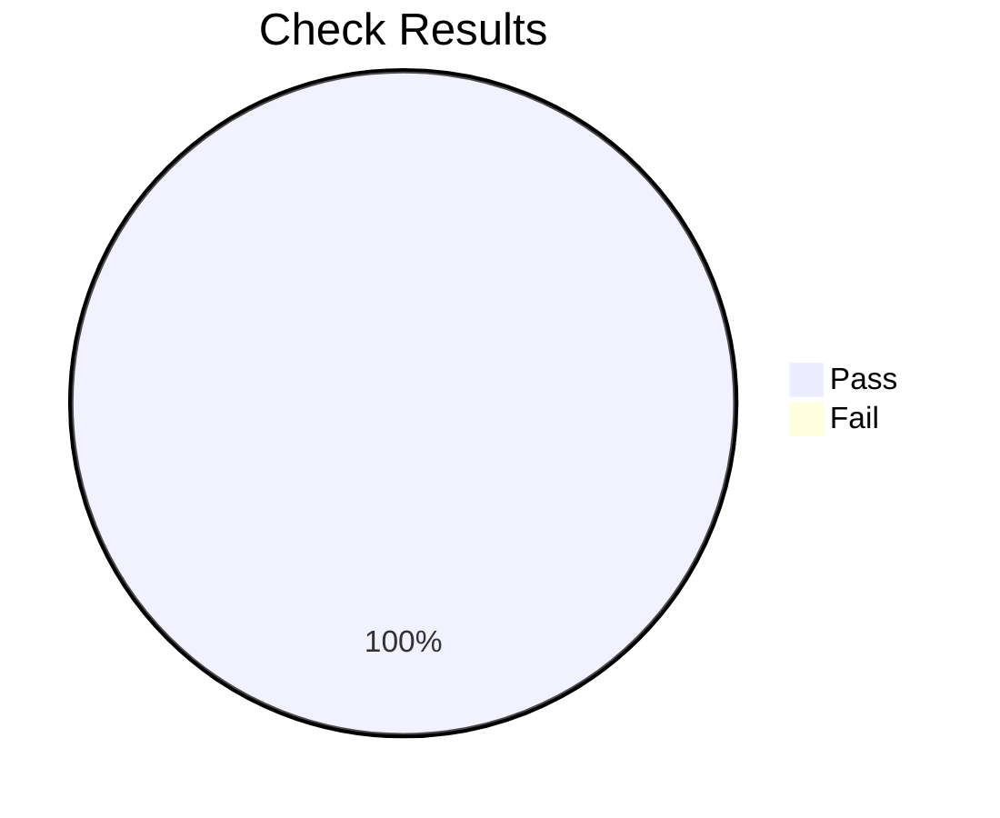

# CVEListv5 + CRIT Conformance Report

**Date:** 2026-05-09 10:01:46 UTC  
**Verdict:** PASS  
**CVE Files:** 27 | **Rules:** 20 | **Checks:** 540  
**Passed:** 540 | **Failed:** 0  

## Overall Results

## Results by CVE Year

| Year | Files | Checks | Passed | Failed | Rate |
|------|------:|-------:|-------:|-------:|-----:|
| 2021 | 1 | 20 | 20 | 0 | 100.0% |
| 2022 | 1 | 20 | 20 | 0 | 100.0% |
| 2023 | 4 | 80 | 80 | 0 | 100.0% |
| 2024 | 18 | 360 | 360 | 0 | 100.0% |
| 2025 | 3 | 60 | 60 | 0 | 100.0% |

## Rule Results

| Status | Section | Rule | Passed | Failed | Requirement |
|:------:|:-------:|------|-------:|-------:|-------------|
| PASS | 10.1 | `cve-record-data-type` | 27 | 0 | dataType MUST be "CVE_RECORD" |
| PASS | 10.1 | `cve-record-data-version` | 27 | 0 | dataVersion MUST match CVEListv5 version (^5\.\d+) |
| PASS | 10.1 | `cve-id-format` | 27 | 0 | cveMetadata.cveId MUST match ^CVE-[0-9]{4}-[0-9]{4,19}$ |
| PASS | 10.1 | `cve-state-published` | 27 | 0 | cveMetadata.state MUST be PUBLISHED for records containing x_crit data |
| PASS | 10.1 | `cve-assigner-org-id-present` | 27 | 0 | cveMetadata.assignerOrgId MUST be non-empty |
| PASS | 10.1 | `adp-provider-metadata-present` | 27 | 0 | Each ADP container MUST have providerMetadata with non-empty orgId |
| PASS | 10.1.1 | `adp-container-present` | 27 | 0 | CVE record MUST contain an ADP container matching --adp-short-name |
| PASS | 10.1.1 | `x-crit-array-present` | 27 | 0 | ADP container MUST contain non-empty x_crit array |
| PASS | 10.1.1 | `x-crit-vuln-id-matches-cve` | 27 | 0 | Each x_crit entry vuln_id MUST match cveMetadata.cveId |
| PASS | 10.1.1 | `x-crit-natural-key-unique` | 27 | 0 | No two x_crit entries MAY share same (vuln_id, provider, service, resource_type) tuple |
| PASS | 10.1.1 | `x-crit-one-per-natural-key` | 27 | 0 | x_crit array MUST contain one entry per natural key tuple applicable to the CVE |
| PASS | 9.1 | `x-crit-service-key-pattern` | 27 | 0 | Each x_crit entry service MUST match ^[a-z][a-z0-9_]*$ |
| PASS | 9.1 | `x-crit-template-format-matches-provider` | 27 | 0 | Each x_crit entry template_format MUST match provider |
| PASS | 4.1 | `x-crit-dates-iso8601` | 27 | 0 | All date fields in x_crit temporal MUST be valid ISO 8601 full-date (YYYY-MM-DD) |
| PASS | 4.4.1 | `x-crit-false-only-when-auto-provider` | 27 | 0 | existing_deployments_remain_vulnerable=false ONLY when fix_propagation=automatic AND shared_responsibility=provider_only |
| PASS | 4.4.2 | `x-crit-no-fix-no-date` | 27 | 0 | fix_propagation=no_fix_available -> provider_fix_date MUST be absent |
| PASS | 4.4.3 | `x-crit-sequence-contiguous` | 27 | 0 | remediation_actions sequence MUST be unique and contiguous starting at 1 |
| PASS | 12.3 | `x-crit-dictionary-lookup` | 27 | 0 | Each x_crit (provider, service, resource_type) MUST resolve to a dictionary entry |
| PASS | 12.3 | `x-crit-template-matches-dictionary` | 27 | 0 | Each x_crit template MUST match the dictionary entry template |
| PASS | 12.3 | `x-crit-region-behavior-consistent` | 27 | 0 | global-only dictionary entries MUST NOT have a named-variable {region} slot |

## Failures

None.

---

*Generated by [crit-validate](https://github.com/Vulnetix/ietf-crit-spec/cmd/crit-validate)*

<!-- sha256: 3468f52fea25151cabe129d7b8130b28407c183f225498da0af347283d6e511b -->
